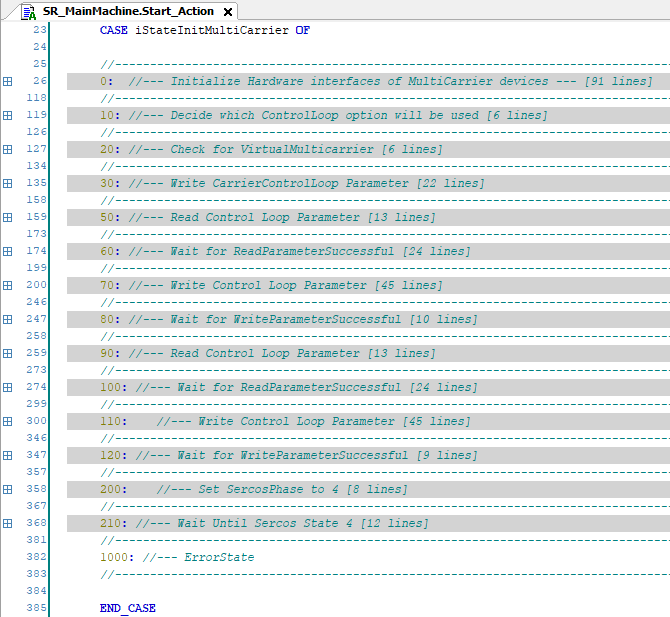
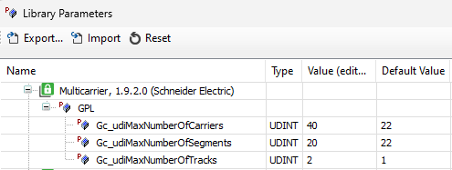
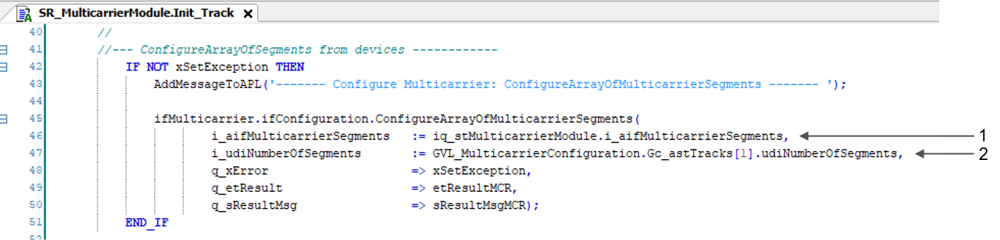

# Multicarrier Configuration

## Multicarrier Configuration Editor

For detailed information, refer to the [Multicarrier Configuration Editor section of the Lexium™ MC multi carrier Example Guide](../../../../../api/crossBook?lang=en-US&virtualBookName=exMulCar&topicID=MC_ConfigTool_2BA5010B).

## SR\_MainMachine

In the action SR\_MainMachine.Start\_Action, you find an additional state machine for parametrizing and activating the Multicarrier. In the project, the Sercos phase is set to zero per default.

The following graphic illustrates the different states along with comments for the corresponding processes:

In the following, you find some detailed descriptions for state 0. For states 10, 30, 60 and 70, refer to the [SR\_MainMachine section of the Lexium™ MC multi carrier Example Guide](../../../../../api/crossBook?lang=en-US&virtualBookName=exMulCar&topicID=SR_MainMach_2BA50C77).

**State 0**

| Stage | Description |
| --- | --- |
| **1** | The device objects of the first track must be assigned to an interface in the local structure stMulticarrierModule1.  Use the methods AssignTrack1, AssignSegments1 and AssignCarriers1 to assign the devices to stMulticarrierModule1.        The structure is transferred to the SR\_MulticarrierModule1. |
| **2** | The working direction from the global variable list GVL\_MulticarrierConfiguration is written to the first track object. |
| **3** | The device objects of the second track must be assigned to an interface in the local structure stMulticarrierModule2.  Use the methods AssignTrack2, AssignSegments2 and AssignCarriers2 to assign the devices to stMulticarrierModule2.        The 21st carrier (MC\_Carrier\_21) is assigned as the first carrier of stMulticarrierModule2. It is the first element of the array.  The structure is transferred to the SR\_MulticarrierModule2. |
| **4** | The working direction from the global variable list GVL\_MulticarrierConfiguration is written to the second track object. |
| **5** | In case of running a physical device, the working mode is set to Real for the appropriate segments by setting the variable Gc\_xVirtualMulticarrier to FALSE.  In case of running a virtual device, the working mode is set to Virtual for the appropriate segments by setting the variable Gc\_xVirtualMulticarrier to TRUE. |
| **6** | The Sercos phase is set to 2. |

NOTE: The project is conceived for two tracks composed of 20 segments each and of a carrier pool of 40 carriers. The first 20 carriers are assigned in AssignCarrier1 to the first track. The other 20 carriers are assigned in AssignCarrier2 to the second track.

To modify the numbers, assign the appropriate tracks / segments / carriers in the methods AssignTrackX / AssignSegmentsX / AssignCarriersX.

NOTE: You must set the global parameters Gc\_udiMaxNumberOfCarriers, Gc\_udiMaxNumberOfSegments and Gc\_udiMaxNumberOfTracks in the Multicarrier library to the corresponding number of hardware elements. Adjust them to match the number of carriers, segments and tracks:

**[State 10](../../../../../api/crossBook?lang=en-US&virtualBookName=exMulCar&topicID=State10_310887BD)**

**[State 30](../../../../../api/crossBook?lang=en-US&virtualBookName=exMulCar&topicID=State30_31088E0B)**

**[State 60](../../../../../api/crossBook?lang=en-US&virtualBookName=exMulCar&topicID=State60_3108940D)**

**[State 70](../../../../../api/crossBook?lang=en-US&virtualBookName=exMulCar&topicID=State70_31089958)**

## SR\_MulticarrierModuleX

For mapping the hardware configuration to the Multicarrier library, the action Init\_Track in the subroutine SR\_MulticarrierModuleX is used.

In this action, the generated global variables in the global variable list GVL\_MulticarrierConfiguration of the Multicarrier Configuration editor are used. This means that when using the Multicarrier Configuration editor, the configuration of the library is automatically adapted.

| Item | Description |
| --- | --- |
| **1** | Structure with segment interfaces transferred from SR\_MainMachine |
| **2** | Variable from the Multicarrier Configuration editor |

EIO0000005984.00