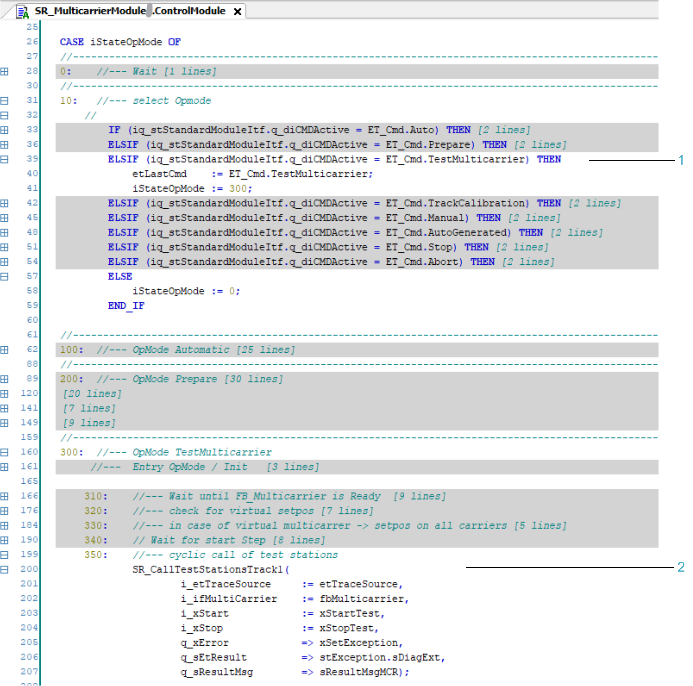
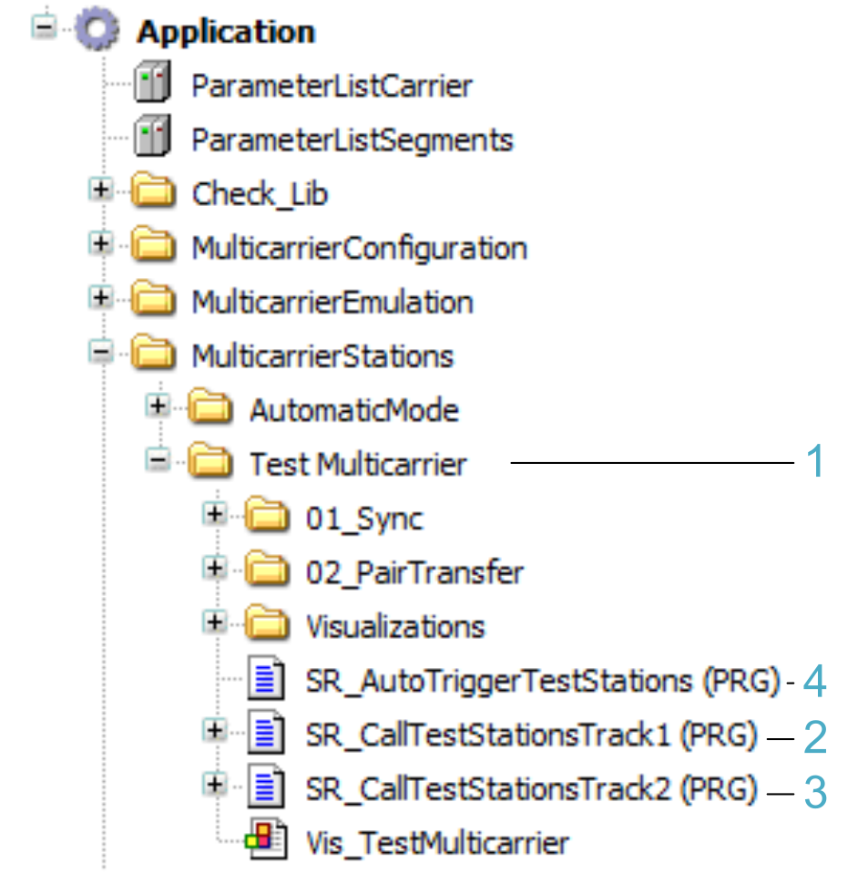
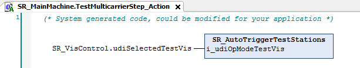

# TestMulticarrier

## Overview

The application examples in the operation mode TestMulticarrier demonstrate interaction in processes running on two different Lexium™ MC12 multi carrier tracks.

## Call of Test Stations

In the ControlModule  of the subroutine SR\_MulticarrierModuleX, the command for the operation mode TestMulticarrier is executed and cyclically calls the examples.

| Item | Description |
| --- | --- |
| **1** | Command for executing the test stations |
| **2** | Cyclic call of test stations |

The folder Test Multicarrier with the application examples is a subfolder of the folder MulticarrierStations.

| Item | Description |
| --- | --- |
| **1** | Folder which includes the test examples |
| **2** | Program in which the example programs (test stations) of the first multicarrier module are called |
| **3** | Program in which the example programs (test stations) of the second multicarrier module are called |
| **4** | Program in which the example programs (test stations) of both multicarrier modules are called |

The program SR\_AutoTriggerTestStations is called in the action TestMulticarrierStep\_Action of SR\_MainMachine. This helps ensure that the program is only called when the operation mode TestMulticarrier is active while enabling the stations feedback of the different modules to be synchronized.

EIO0000005984.00