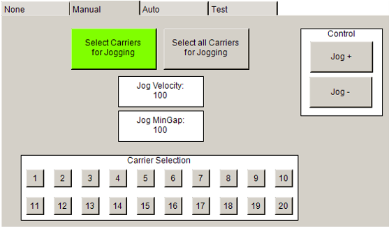

# Manual Mode

## Overview

In Manual mode, the carrier can be moved as soon as Sercos is in phase four and the program is started. Via the visualization, you can select individual carriers or all carriers at a time. Additionally, the velocity and the minimum gap between the carriers can be defined.

EIO0000005984.00