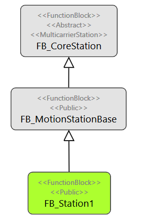
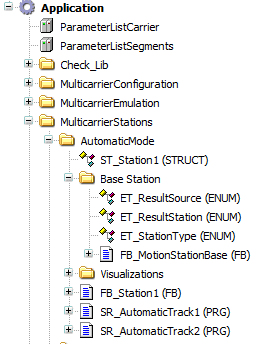

# Auto Mode

## Overview

For the operation mode Auto, one station is already implemented in order to show the necessary steps for adding another station.

The example station has three layers:

| Layer | Name | Description |
| --- | --- | --- |
| **1** | FB\_CoreStation | The first layer is the carrier handling from the function block FB\_CoreStation from the MulticarrierStation library. |
| **2** | FB\_MotionStationBase | The second layer is a function block with the methods and properties needed for any station, like for example the method SetStationParameter or the property ErrorQuit. |
| **3** | FB\_Station1 (Example) | The third layer has a functional station-specific logic. |

Each MulticarrierModule calls a program that handles its stations while in operation mode Auto. In this example, SR\_MulticarrierModule1 calls SR\_AutomaticTrack1, and SR\_MulticarrierModule2 calls SR\_AutomaticTrack2.

The station function blocks and the programs for the operation mode Auto can be found in the folder MulticarrierStations.

NOTE: The FB\_CoreStation is a hidden function block.

EIO0000005984.00