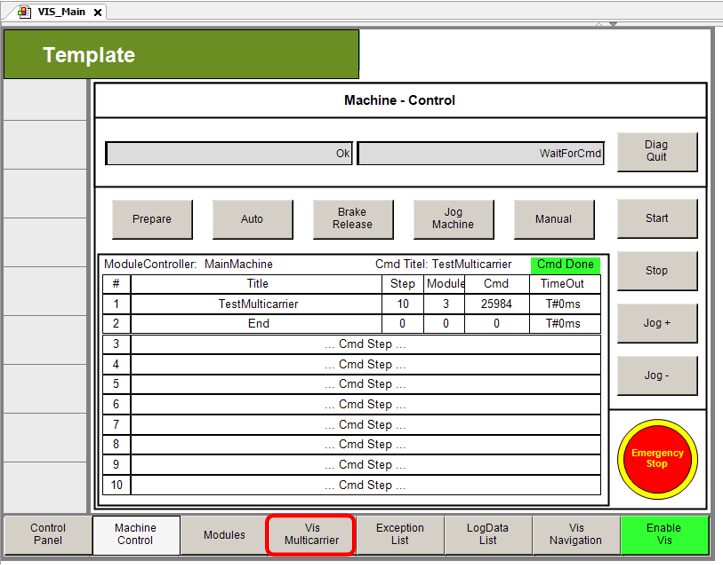
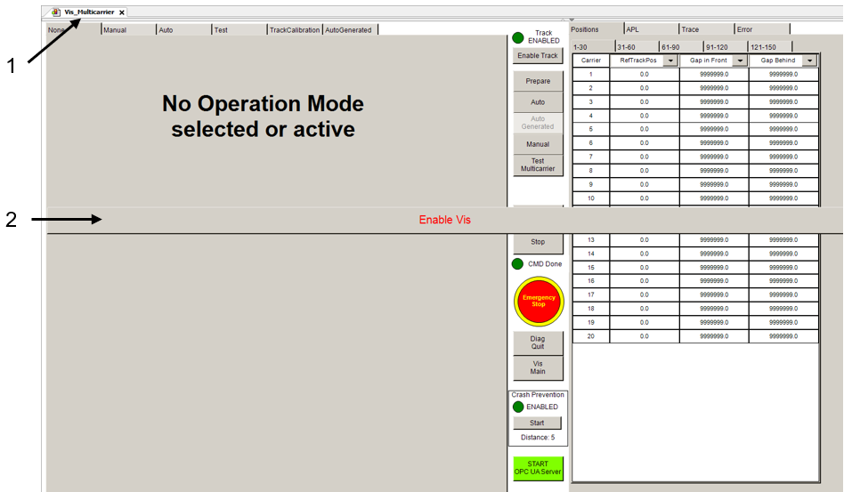
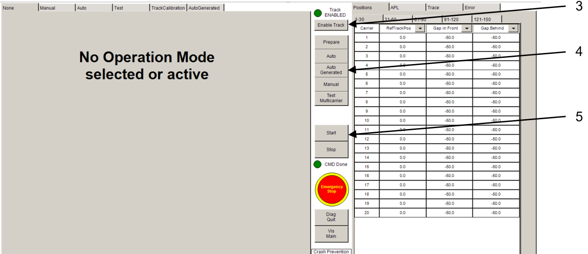

# Opening the Multicarrier Visualization

## Overview

The application example implements a visualization in the Logic Builder that can be used to control and monitor the application.

## Opening the Visualization

To open the Multicarrier visualization, use Vis\_Main > Vis Multicarrier

For starting an operation mode within the visualization, proceed as follows:

 

| Step | Action |
| --- | --- |
| **1** | Open the Vis\_Multicarrier visualization. |
| **2** | Enable the visualization by clicking the Enable Vis button. |
| **3** | Enable the track by clicking the Enable Track button. |
| **4** | Select the required mode by clicking the corresponding button, for example the AutoGenerated button. |
| **5** | Start the mode by clicking the Start button. |

EIO0000005984.00