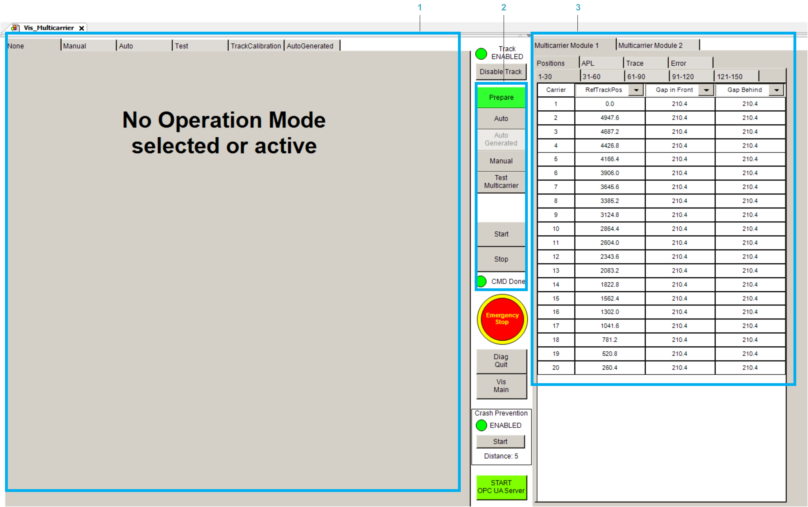

# Working with the Multicarrier Visualization Vis\_Multicarrier

The Vis\_Multicarrier visualization consists of different areas:

| Item | Description |
| --- | --- |
| **1** | Area dedicated to the active mode. |
| **2** | Buttons to switch the active mode and start/stop it. |
| **3** | Area dedicated to the MulticarrierModules including carrier feedback, application logger settings, assignment to traces and the display of detected module errors. |

EIO0000005984.00