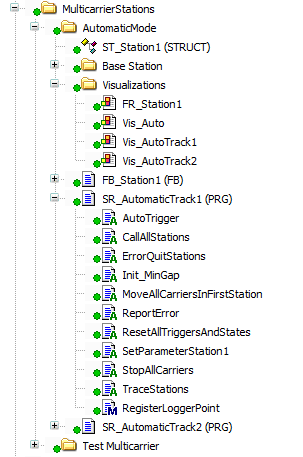
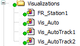

# Executing a Station

## Overview

For executing the stations, a number of actions are provided, for example for error handling or for the registration to the Application Logger.

The folder MulticarrierStations contains the following subfolders:

* AutomaticMode that contains code for the stations in automatic mode
* Test Multicarrier that contains code for the example of the Test Multicarrier
* Autogenerated (optionally) that contains code for AutoGenerated mode if they were generated

The AutomaticMode folder contains two programs: SR\_AutomaticTrack1 and SR\_AutomaticTrack2. The programs are respectively called by SR\_MulticarrierModule1 and SR\_MulticarrierModule2. They call and handle the diagnostics of the stations. Both have the same actions defined.

The Visualizations folder contains the visualizations.

Vis\_Auto is the visualization that is displayed when the operation mode Auto is active. It allows you to switch between Vis\_AutoTrack1 with the stations of track one and Vis\_AutoTrack2 with the stations of track two. The frames of the stations are also in this folder. You can modify them to adapt them to your application.

EIO0000005984.00