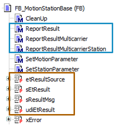
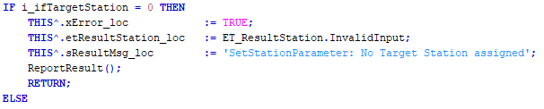
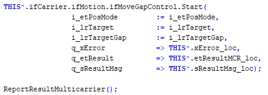
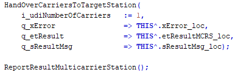

# Error Messages

## Overview

A station function block handles three different sources of error messages.

* Multicarrier library (for example, for errors detected by the move commands MoveGapControl or MoveDirectly)
* MulticarrierStation library (for example, for errors detected by the method HandoverCarriersToTargetStation )
* Application-specific errors

For each source, a report method is available (see the blue frame in the picture below) that provides the following information:

| Name | Description |
| --- | --- |
| etResultSource | Provides the source. |
| sEtResult | Provides the result enumeration as text messages. |
| sResultMsg | Provides the result messages. |
| udiEtResult | Provides the result enumeration as numeric values. |

## Report Methods

| Method | Description |
| --- | --- |
| ReportResult | Method for application-specific messages, for example the message that no target station is assigned.  The method adds the name of the corresponding station. |
| ReportResultMulticarrier | The method copies the results from the Multicarrier library and adds the station name and the carrier list ID number of the station.  For testing, you can generate an error by setting the velocity higher than maximum value. |
| ReportResultMulticarrierStation | The method copies the results from the MulticarrierStation library to the properties and adds the name of the corresponding station.  For testing, you can try requesting a carrier with index 0. |

## Calling Report Methods (Examples)

The methods must be called after the call of a library method:

**Example for ReportResult:** 

**Example for ReportResultMulticarrier:** 

**Example for ReportResultMulticarrierStation:** 

EIO0000005984.00