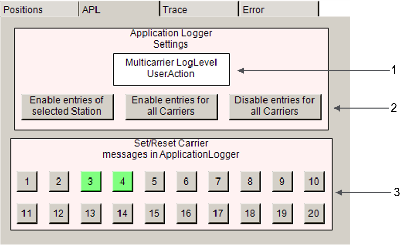
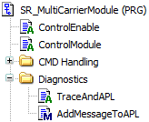
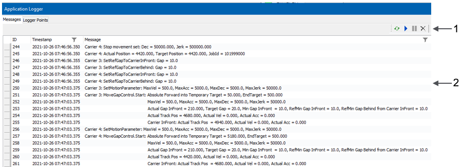
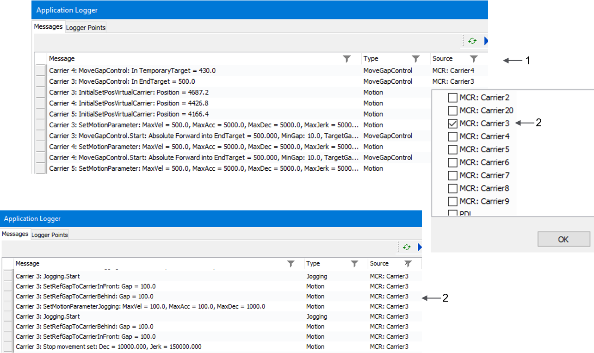
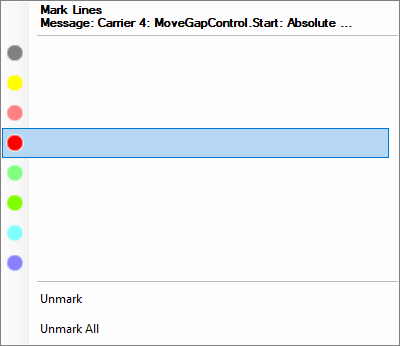
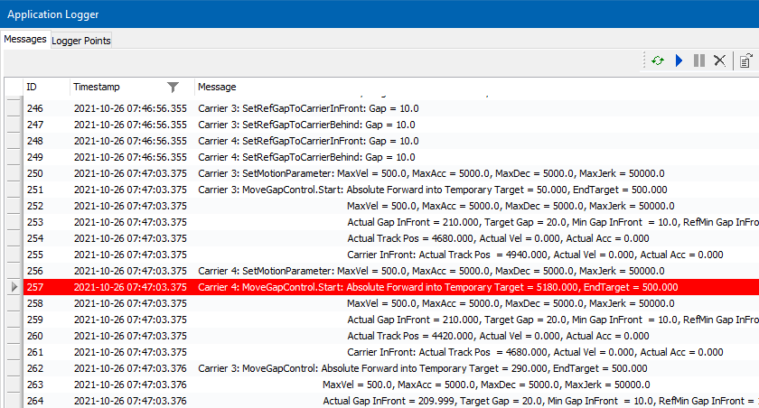

# Application Logger – General Information

## Overview

The different methods used for the Application Logger (APL) are described in the Multicarrier Library Guide:

* [RegisterloggerPoint](../../../../../api/crossBook?lang=en-US&virtualBookName=MLSLib&topicID=RegistLogPoint_03EFE767)
* [SetApplicationLoggerLogLevel](../../../../../api/crossBook?lang=en-US&virtualBookName=MLSLib&topicID=SetAPLLogLevel_03F0750A)
* [ConfigureApplicationLoggerEntries](../../../../../api/crossBook?lang=en-US&virtualBookName=MLSLib&topicID=ConfigAplEntries_E1DF1BA4)

For more information, refer to the [Multicarrier Library Guide](../../../../../api/crossBook?lang=en-US&virtualBookName=MLSLib&topicID=)

In the visualization Vis\_Multicarrier, you find a tab for APL settings on the right side next to the main screen:

| Item | Description |
| --- | --- |
| **1** | Allows you to enter the logger level for the messages of the Multicarrier components. |
| **2** | Selection buttons (from left to right):  * Button for enabling Application Logger entries for the carriers of the stations; the carriers to be logged are defined for a selected station. For more information, refer to [Station-based Carrier Logging](StationCarrLog-366A4FEE.html#StationCarrLog-366A4FEE) . * Button for selecting all carriers. * Button for deselecting all carriers. |
| **3** | Number buttons for selecting individual carriers to be logged. For these carriers, logger messages are written to the Application Logger. |

The visualization settings are written to the variable ifMulticarrier in the action TraceAndAPL which can be found in the folder Diagnostics:

## Reading Application Logger Messages

The logger messages are displayed in the Messages tab of the Application Logger:

| Item | Description |
| --- | --- |
| **1** | Icons of the Messages tab. With the green icon, you can refresh the content of the Messages tab.  For more information on the icons, refer to the [Menu Commands Online Help](../../../../../api/crossBook?lang=en-US&virtualBookName=SoMMenu&topicID=D_SE_0091294). |
| **2** | Examples of loaded Application Logger messages. |

## Filtering Application Logger Messages

The columns in the Messages tab offer a filter in order to reduce the number of messages. By filtering the column Source, you can select the messages for individual carriers:

| Step | Action |
| --- | --- |
| **1** | Filter the column Source. |
| **2** | Select MCR: Carrier3  **Result:** Messages for carrier 3 are displayed. |

## Marking Application Logger Messages

In the Application Logger, you can mark lines by right-clicking a cell with the desired selection criterion and selecting a color in the contextual menu:

For more information on marking lines, refer to the [Menu Commands Online Help](../../../../../api/crossBook?lang=en-US&virtualBookName=SoMMenu&topicID=D_SE_0091296#D_SE_0091296_3).

**Result:** The lines corresponding to the selection criterion are displayed as marked lines:

EIO0000005984.00