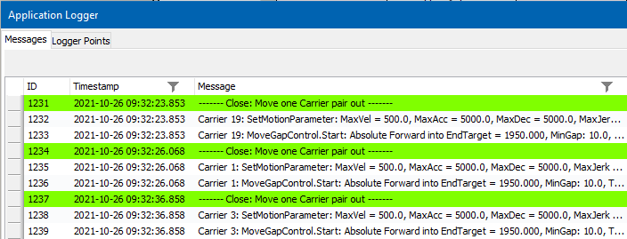

# Station-based Carrier Logging

## Overview

For logging the movements of the carriers for specific stations, two steps are required:

1. General activation of the setting/resetting mechanism for stations.
2. Specification for which station the Application Logger entries will be set or reset.

The function block FB\_CoreStation of the [MulticarrierStation library](../../../../../api/crossBook?lang=en-US&virtualBookName=MCRSLib&topicID=FB_CoreStation_CDC7F259) provides two properties required for the logging of the carrier movement on station basis:

* xEnableActivationOfAPLEntriesForCarriers
* xActivateAPLEntriesForMovedCarriers

## Example

For the test station example PosAndSync, execute the following two steps:

| Step | Action |
| --- | --- |
| **1** | Enable the setting/resetting of Application Logger entries for stations by clicking the button Enable entries of selected Station which sets the property xEnableActivationOfAPLEntriesForCarriers to TRUE. |
| **2** | If, for example, only the movements of the carriers in the Close Station should be written to the Application Logger, click the button Set Carrier APL Msg within the Close Station display. By clicking the button Set Carrier APL Msg, the property xActivateAPLEntriesForMovedCarriers is set to TRUE. |

**Result:** Messages from carriers that are moved from the Close Station are entered in the Application Logger:

EIO0000005984.00