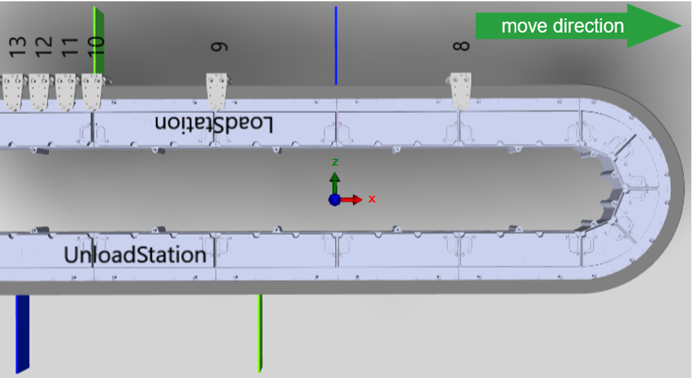
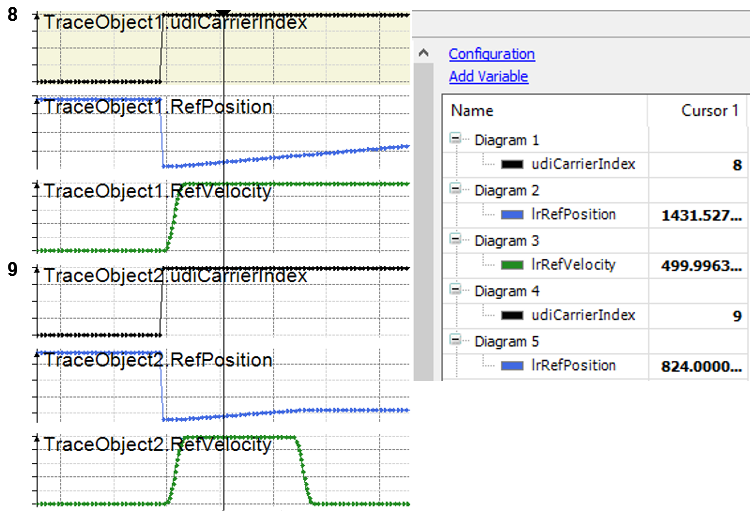
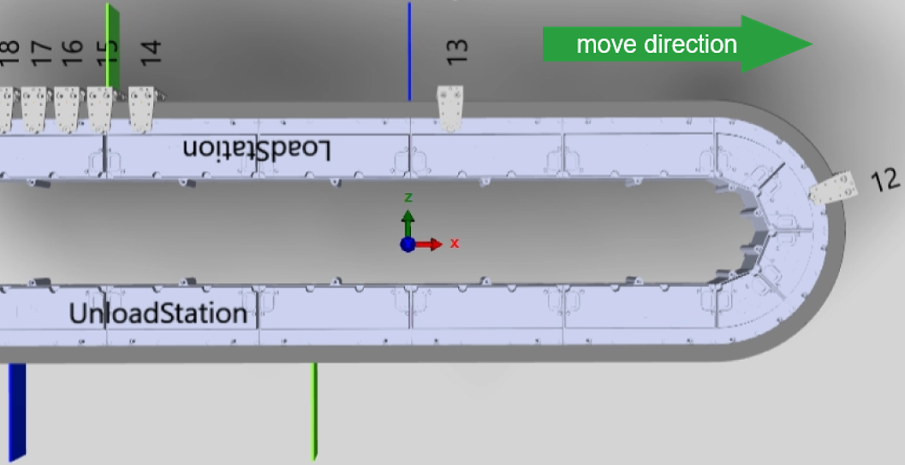
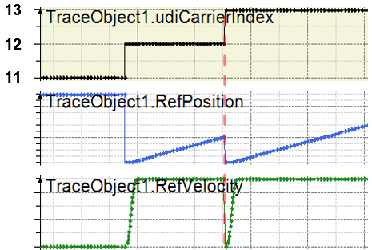
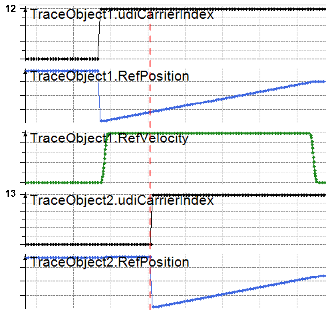
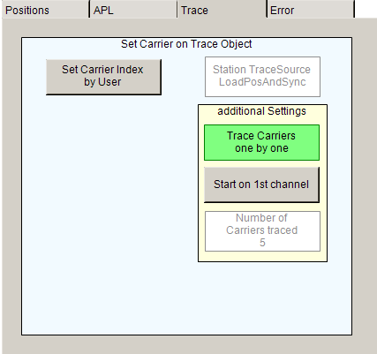

# Trace – Additional Settings

## Overview

By default, the program SR\_CarriersInStationToTrace writes the carriers to the trace as soon as a new movement is triggered.

In the following example, carrier 8 moves out of the LoadStation and carrier 9 moves from the green-marked waiting position to the blue-marked process position of the LoadStation:

As soon as the carriers start their movement, the corresponding values are written to the trace:

## Avoid Overwriting of Values

A trace overwriting can occur if two carriers are sent out of the station in a short time interval one after the other.

In the following example, carrier 13 is sent out shortly after carrier 12, with carrier 12 still moving:

Without further measures, the station overwrites the trace values for carrier 12 by the values for carrier 13 as the values are written on channel 1 by default. The red dotted line illustrates the start of carrier 13:

To avoid this overwriting, another channel of the trace must be selected for a new movement of a carrier. The red dotted line illustrates the start of carrier 13 on another channel:

For selecting another channel of the trace for a new movement of a carrier, click the button Trace Carriers one by one:

When you click the button Start on 1st channel, the next carrier that starts moving is traced on channel 1. This is only relevant when the function Trace Carrier one by one is active.

In the text field Number of Carriers traced, you can enter the number of carriers that you want to be traced. The tracing behavior depends on the setting of the function Trace Carrier one by one.

| If the number of carriers to be traced is set to 3 and Trace Carrier one by one is... | Then... |
| --- | --- |
| active | only three channels are used for trace writing.  If, for example, four carriers are sent out after each other, the fourth carrier is written on channel 1. |
| not active | only three channels can be traced in parallel.  If, for example, five carriers are sent out, only three carriers are written to the trace. |

EIO0000005984.00