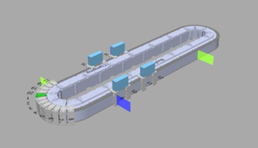
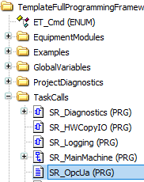
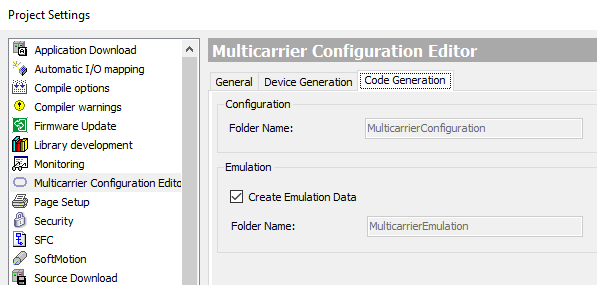
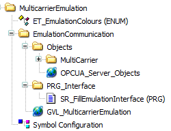
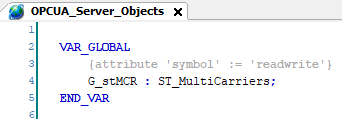
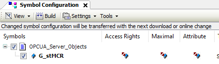
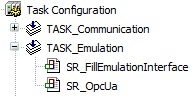

# Preconditions for Emulation with Multicarrier Configuration Editor

## Overview

Within the Multicarrier example project, you can use the implemented visualization of the Multicarrier Configuration editor.  

For using the implemented visualization in a user-defined project, the following preconditions must be fulfilled:

* EcoStruxure Machine Expert Twin is installed.
* An OPC UA server is implemented.
* Data for exchange via the OPC UA server are available.
* Symbol configuration variables are set.
* The program SR\_FillEmulationInterface is called.
* The project is downloaded and the application is started.

## Installing EcoStruxure Machine Expert Twin

The EcoStruxure Machine Expert Twin must be installed via the Schneider Electric Software Installer.

## Implementing an OPC UA Server

In a new project, an OPC UA server must be implemented.  
In the Multicarrier example project, the OPC UA server is already implemented:

For more information on enabling an OPC UA server, refer to the [OpcUa Client Example Guide](../../../../../api/crossBook?lang=en-US&virtualBookName=exOpcUa&topicID=D_SE_0101420#D_SE_0101420_3).

## Required Exchange Data

For using the emulation, appropriate data are required for the exchange between the project and the emulation via an OPC UA server.

In the Multicarrier example project, the required data are already available.

For a new project, the data can be provided by the Multicarrier Configuration editor.   
For this, open the Project > Project Settings > Multicarrier Configuration Editor > Code Generation dialog box and verify that the option Create Emulation Data is activated.

For more details on the project settings of the Multicarrier Configuration Editor, refer to the [Menu Commands Online Help](../../../../../api/crossBook?lang=en-US&virtualBookName=SoMMenu&topicID=TPC_MLS_Config_Tools_Options_D995A499).

The exchange data are found in the folder MulticarrierEmulation:

The required variables for the symbol configuration are added via an attribute:

## Calling SR\_FillEmulationInterface

The program SR\_FillEmulationInterface must be called in a TASK:

EIO0000005984.00