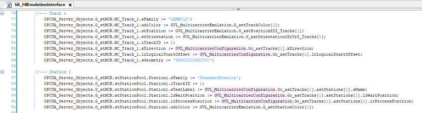
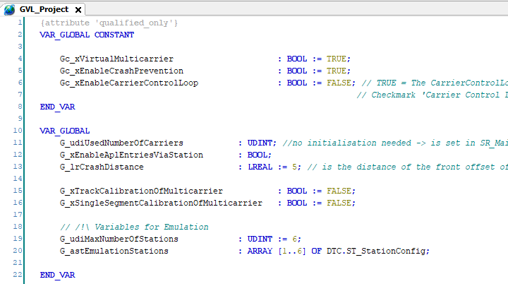
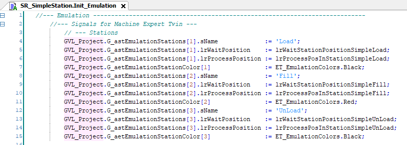
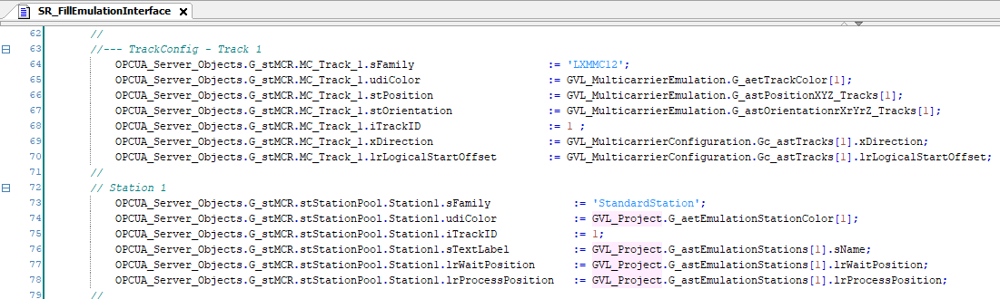
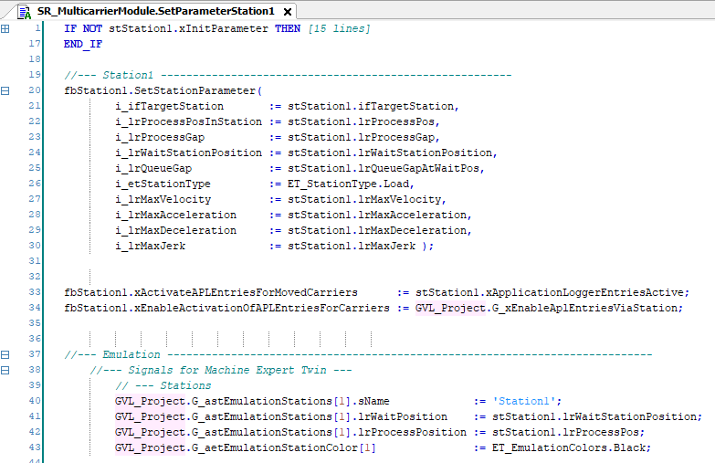

# Emulation Data for Test Stations

## Overview

In general, the emulation variables in the sub-routine [SR\_FillEmulationInterface](EmulatPrecon-37601F4C.html#EmulatPrecon-37601F4C__FillEmulationIF-377450D0) are provided by the global variable list GVL\_MulticarrierConfiguration of the Multicarrier Configuration editor:

The test stations in the example project, however, require a specific procedure in order to prevent compilation errors.

## Special Approach for Test Stations

The provided test stations in the example project require a defined number of stations. If this defined number is overwritten by the emulation data coming from the Multicarrier Configuration editor, compilation errors could result.

Therefore, the global variable list GVL\_Project is used. This list includes an array for the stations in the examples:

The program for every example includes the action Init\_Emulation for filling the variables of the array:

In the sub-routine SR\_FillEmulationInterface, the array variables are used for the emulation interface:

The global array G\_astEmulationStations is not only used for the operation mode TestMulticarrier but also for the automatic mode:

## Application-specific Emulation

For user-defined applications, generate the emulation via the update mechanism of the Multicarrier Configuration editor. For more information on the update mechanism, refer to the [Lexium™ MC multi carrier Configuration Guide](../../../../../api/crossBook?lang=en-US&virtualBookName=MLSConfG&topicID=TPC_MLS_Config_Tab_Track_D99C4272#UpdateCommandDetails_DA1C4D4F).

NOTE: If the emulation data of the test station examples are overwritten by the Multicarrier Configuration editor, the examples still work but the stations are not visible in the emulation.

EIO0000005984.00