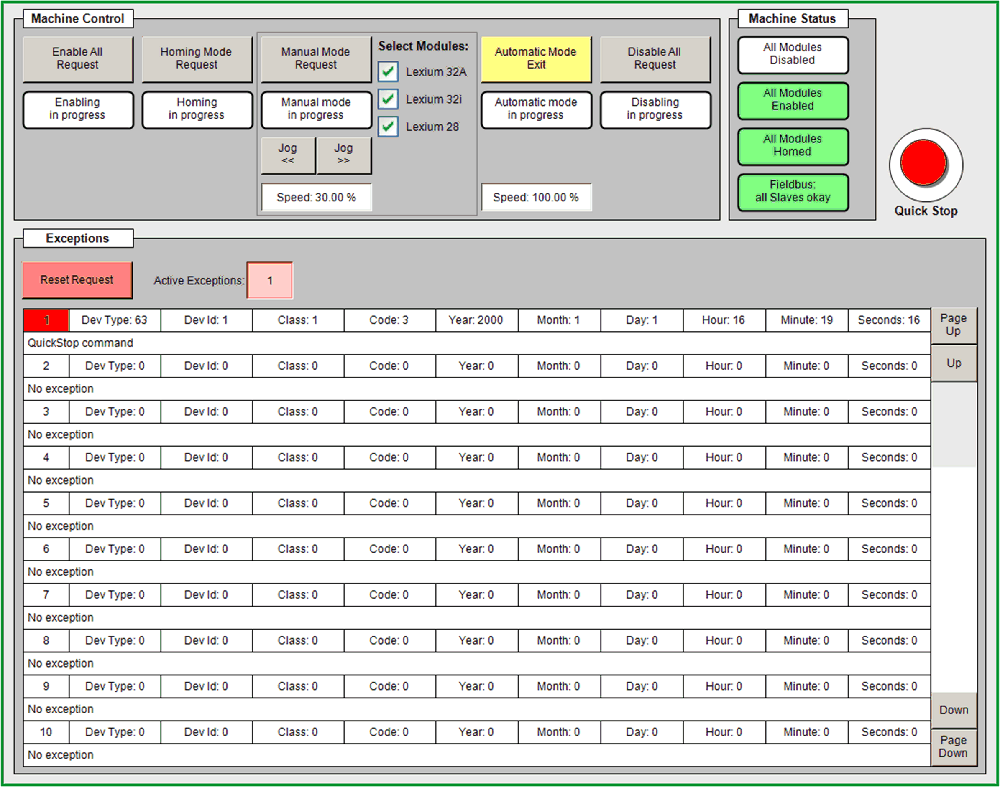

# Visualization Screen - VisuMainMachine

Visualization Screen - VisuMainMachine

A general overview and a main control panel are provided on the visualization screen VisuMainMachine.

In addition, for each Lexium module a separate visualization screen is implemented. These visualization screens provide extensive control functions which can be used during commissioning phase.