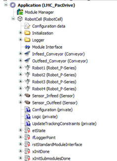
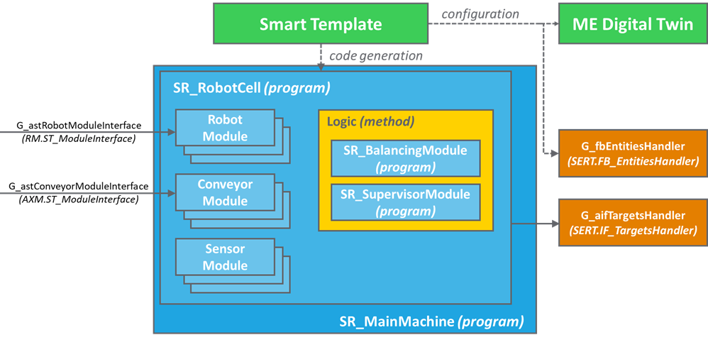

# Overview of the Application

## Position in the Devices Tree

The hardware objects are mapped in the Devices tree of the project. In the example project, several robots, conveyors, sensors, and camera modules are already implemented.

## Smart Template RobotCell

The Smart Template is used to generate and configure a RobotCell program that may include robot, conveyor, sensor, and camera modules. Robots and conveyors can be accessed through a set of interfaces that are provided as IN\_OUT of the RobotCell program.

The generated RobotCell program configures an instance of an entities handler. The function block contains a description of the RobotCell that is then accessible at project level.

Optionally, the Smart Template can internally configure an array of the targets handler that is used to keep track of the list of targets in the system. An array of the targets handler interfaces is provided as an output of the RobotCell program and is then accessible at project level.

The Logic method of the RobotCell program runs:

* SR\_BalancingModule: Handles the balancing of the workload of the robots during the execution of the pick and place task.

* SR\_SupervisorModule: Handles the execution of a pick and place task for the entire RobotCell.

All objects that are generated and configured by a Smart Template RobotCell are also automatically configured for the connection with Machine Expert Digital Twin.

EIO0000005357.00