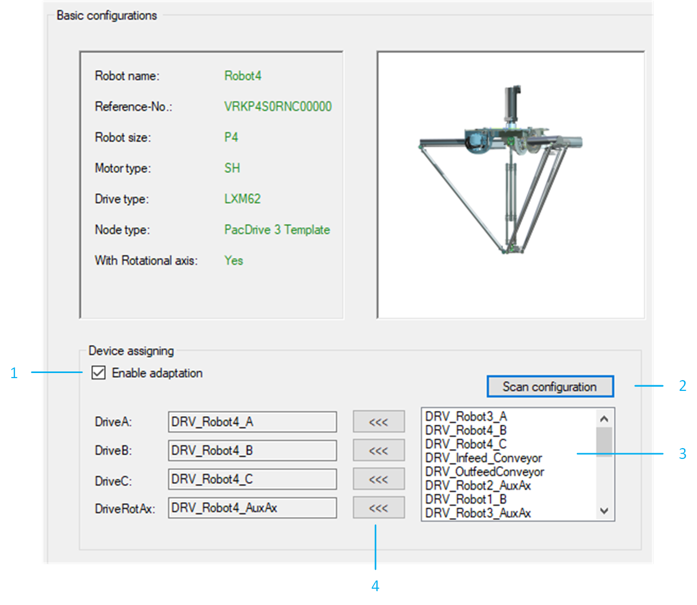
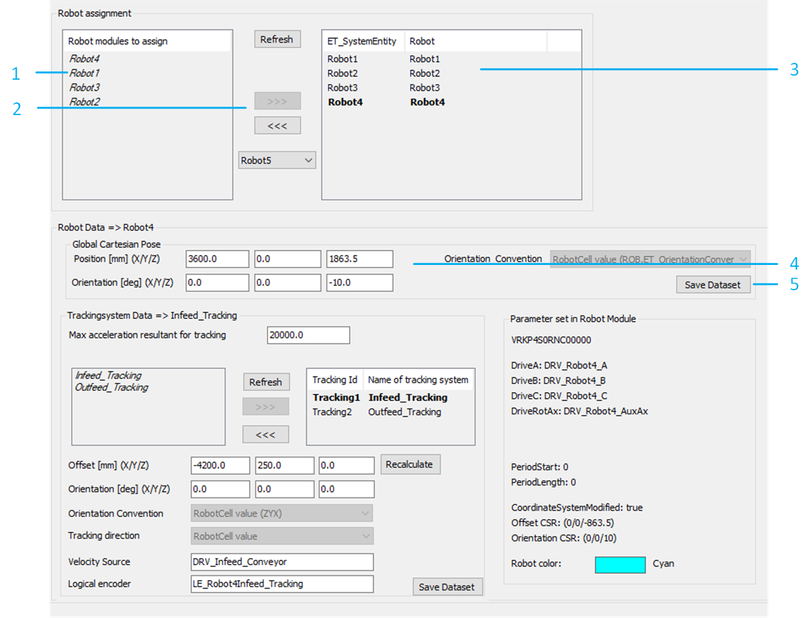
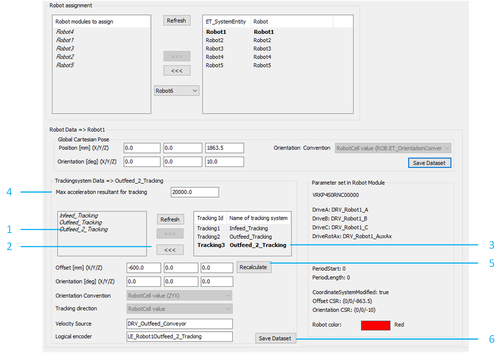

# Adding a Robot

## Overview

To add a robot to your example project, proceed as follows:

| Step | Action |
| --- | --- |
| 1 | Right click on an existing robot and click Copy. |
| 2 | Right click the RobotCell root node and click Paste. |

NOTE: The example project is based on P4 Delta robots. If a different Delta robot type is required, it is possible to change it individually on the Smart Template Robot P-Series Modules in the Basic configurations tab, with the [Robot Type Change](https://olh.schneider-electric.com/Machine%20Expert/V2.2/en/SmrtPSer/index.htm#t=SmrtPSer%2FHowToChangeP-SeriesTypes-E0500004.html) functionalities.

## Device Assignment

It is possible to rename the generated drives. If one or more drives are renamed, ensure that the right device assignments are listed in the Basic configurations tab of the robot.

To assign the devices to the corresponding drive of the robot, proceed as follows:

In the RobotCell modules editor, select <Robot Name> > Configuration data > Basic configurations.

**Result:** The robot configuration data is displayed.

| Step | Action |
| --- | --- |
| 1 | Select Enable adaptation. |
| 2 | Click Scan configuration to update the list. |
| 3 | From the list, select the device to be updated. |
| 4 | Click <<< to assign the selected device to the corresponding drive of the robot. |

## Robot Assignment

To assign the robot to the RobotCell, proceed as follows:

In the RobotCell modules editor, select Configuration data > Robots.

| Step | Action |
| --- | --- |
| 1 | Select a robot from the list under Robot modules to assign. |
| 2 | Click >>> to add the selected robot to the RobotCell.  **Result**: The robot is added to the list with a univocal robot ID value. |
| 3 | Select the previously added robot from the list. |
| 4 | Verify the values of the Global Cartesian Pose.  NOTE: The interface generates default coordinates for the new robot, they can be edited with the layout of the RobotCell. |
| 5 | Click Save Dataset to store the data. |

## Robot Tracking Configuration

Each tracking system of the robot must be configured.

To configure the Trackingsystem Data, proceed as follows:

In the RobotCell modules editor, select Configuration data > Robots.

| Step | Action |
| --- | --- |
| 1 | Select a tracking system from the list on the left-hand side. |
| 2 | Click >>> to add the selected tracking system to the robot. |
| 3 | Select the tracking system from the list on the right-hand side. |
| 4 | Enter a value for Max acceleration resultant for tracking. |
| 5 | Click Recalculate.  **Result**: The interface calculates the relative coordinates of the selected tracking system for the robot. |
| 6 | Click Save Dataset to store the data. |

NOTE: It is possible to verify the new layout of the RobotCell in the 3D Layout tab of the RobotCell  object.

## Additional Considerations

Additional points to consider are the following:

* The demo version contains a default initialization that is automatically applied to the robots in a RobotCell. If the robot requires a different parameterization, it is possible to edit the method RobotCell.Init\_RobotCellData.
* Ensure that the length of the conveyors is sufficient to accommodate the working area of the robot.
* Ensure that the robot has a properly configured pick and place logic for each coordinate system on which it must operate. This can be verified in the method RobotCell.Init\_Supervisor.
* Ensure that the robot is considered by the balancing strategies. This can be verified in the method RobotCell.Init\_Balancing.

EIO0000005357.00