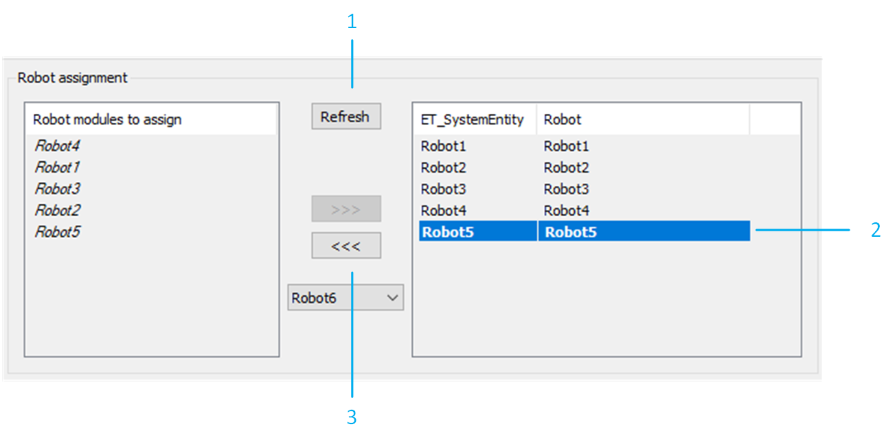

# Removing a Robot

## Overview

To remove a robot from your example project, proceed as follows:

Remove the robot from the Devices tree. In the RobotCell modules editor, select Configuration data > Robots.

| Step | Action |
| --- | --- |
| 1 | Click the Refresh button to ensure that the robot is no longer listed in the list on the left-hand side. |
| 2 | Select the robot to remove from the list on the right-hand side. |
| 3 | Click <<< to remove the selected robot. |

NOTE: It is possible to verify the new layout of the RobotCell in the 3D Layout tab of the RobotCell object.

## Additional Considerations

Additional points to consider are the following:

* Ensure that the removed robot is not considered by the pick and place logic. This can be verified in the method RobotCell.Init\_Supervisor.
* Ensure that the removed robot is not considered by the balancing strategies. This can be verified in the method RobotCell.Init\_Balancing.

NOTE: The drives used by the removed robot are not automatically removed from the project configuration.

EIO0000005357.00