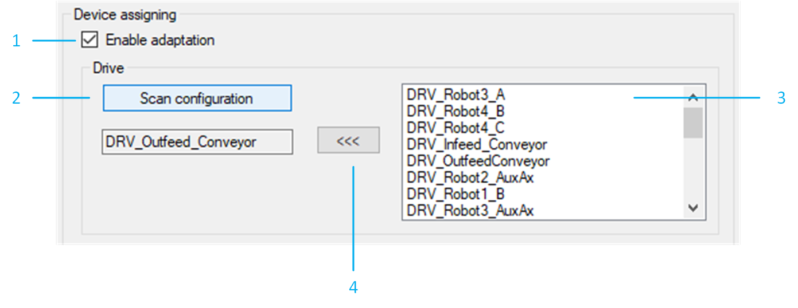
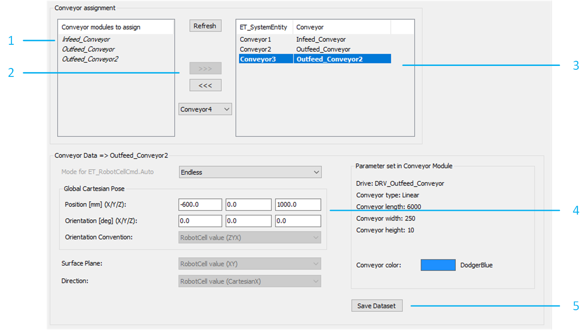

# Adding a Conveyor

## Overview

To add a conveyor to your example project, proceed as follows:

| Step | Action |
| --- | --- |
| 1 | Right click an existing conveyor and click Copy. |
| 2 | Right click the RobotCell root node and click Paste. |

## Device Assignment

It is possible to rename the generated drives. If one or more drives are renamed, ensure that the right device assignments are listed in the Basic configurations tab of the conveyor.

To assign the devices to the corresponding drive of the conveyor, proceed as follows:

In the RobotCell modules editor, select <Conveyor Name> > Configuration data > Basic configurations.

**Result:** The conveyor configuration data is displayed.

| Step | Action |
| --- | --- |
| 1 | Select Enable adaptation. |
| 2 | Click Scan configuration to update the list. |
| 3 | From the list, select the device to be updated. |
| 4 | Cklick <<< to assign the selected device to the corresponding drive of the conveyor. |

## Conveyor Assignment

To assign the conveyor to the RobotCell, proceed as follows:

In the RobotCell modules editor, select Configuration data > Conveyors.

| Step | Action |
| --- | --- |
| 1 | Select a robot from the list under Conveyor modules to assign. |
| 2 | Click >>> to add the selected conveyor to the RobotCell.  **Result**: The conveyor is added to the list with a univocal conveyor ID value. |
| 3 | Select the previously added conveyor from the list. |
| 4 | Verify the values of the Global Cartesian Pose.  NOTE: The interface generates default coordinates for the new conveyor, they can be edited with the layout of the RobotCell. |
| 5 | Click Save Dataset to store the data. |

NOTE: It is possible to verify the new layout of the RobotCell in the 3D Layout tab of the RobotCell object.

EIO0000005357.00