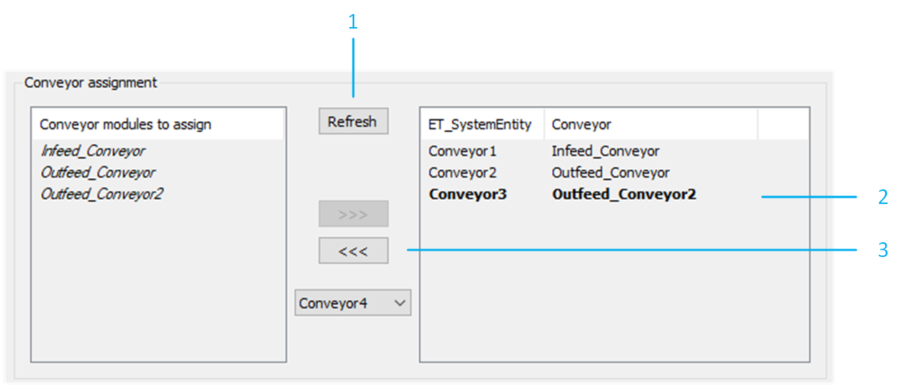

# Removing a Conveyor

## Conveyor

To remove a conveyor from your example project, proceed as follows:

Select and delete the required conveyors under the RobotCell object. In the RobotCell modules editor, select Configuration data > Conveyors.

NOTE: The drives used by the removed conveyor are not automatically removed from the project configuration.

| Step | Action |
| --- | --- |
| 1 | Click the Refresh button to ensure that the conveyor is no longer listed in the list on the left-hand side. |
| 2 | Select the conveyor to remove from the list on the right-hand side. |
| 3 | Click <<< to remove the selected conveyor. |

NOTE: It is possible to verify the new layout of the RobotCell in the 3D Layout tab of the RobotCell object.

## Targets Handler

To remove each targets handler that was using the removed conveyor as a velocity source, proceed as follows:

| Step | Action |
| --- | --- |
| 1 | In the RobotCell modules editor, select Configuration data > Targets Handler. |
| 2 | Select the targets handler to remove from the list on the right-hand side. |
| 3 | Click <<< to remove the selected targets handler. |
| 4 | Click Ok to confirm. |

## Tracking System

To remove each tracking system that was using the removed conveyor as velocity source, proceed as follows:

| Step | Action |
| --- | --- |
| 1 | In the RobotCell modules editor, select Configuration data > Tracking System. |
| 2 | Select the tracking system to remove from the list on the right-hand side. |
| 3 | Click <<< to remove the selected tracking system. |
| 4 | Click Ok to confirm. |

## Robot Tracking Configuration

To remove the tracking system of a robot, proceed as follows:

| Step | Action |
| --- | --- |
| 1 | In the RobotCell modules editor, select Configuration data > Robots. |
| 2 | Select a robot for which one or more of the removed tracking systems were configured. |
| 3 | Click Refresh to update the list on the left-hand side. |
| 4 | Select one of the removed tracking systems from the list on the right-hand side. |
| 5 | Click <<< to remove the selected tracking system from the configuration of the selected robot. |
| 6 | Click Ok to confirm. |

NOTE: It is possible to verify the new layout of the RobotCell in the 3D Layout tab of the RobotCell object .

## Additional Considerations

Additional points to consider are the following:

* Ensure that none of the removed conveyors are still considered by the pick and place logic. This can be verified in the method RobotCell.Init\_Supervisor by verifying the parameters G\_astRoboticCellTargetSelection, G\_astRoboticCellPickSearchLogic and G\_astRoboticCellPlaceSearchLogic .
* Ensure that none of the removed conveyors are still considered by the balancing strategies. This can be verified in the method RobotCell.Init\_Balancing.

EIO0000005357.00