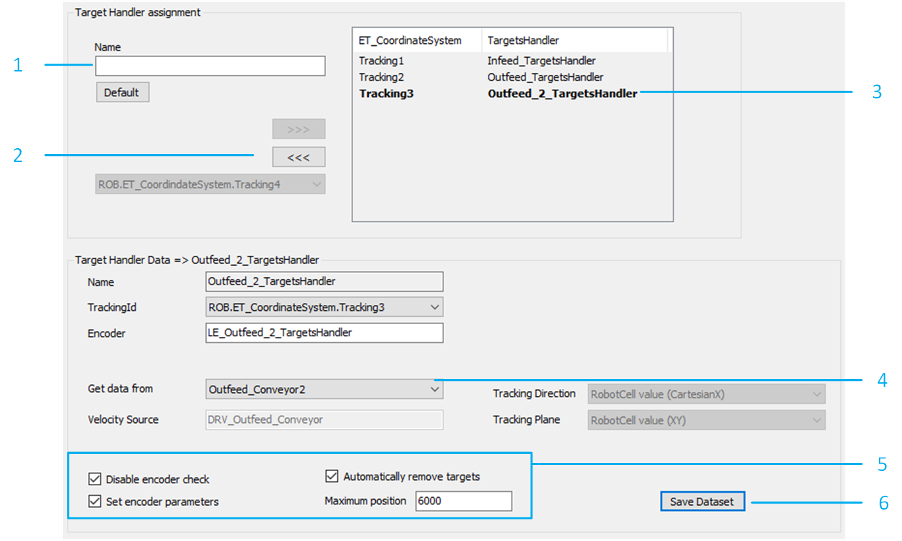
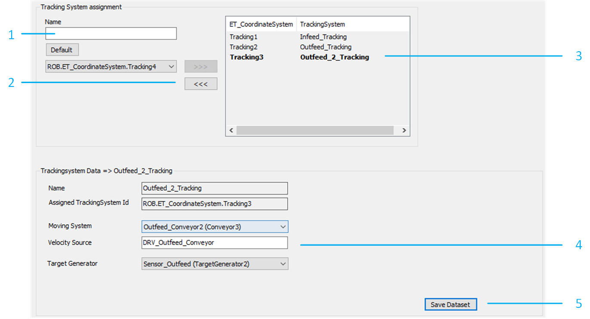
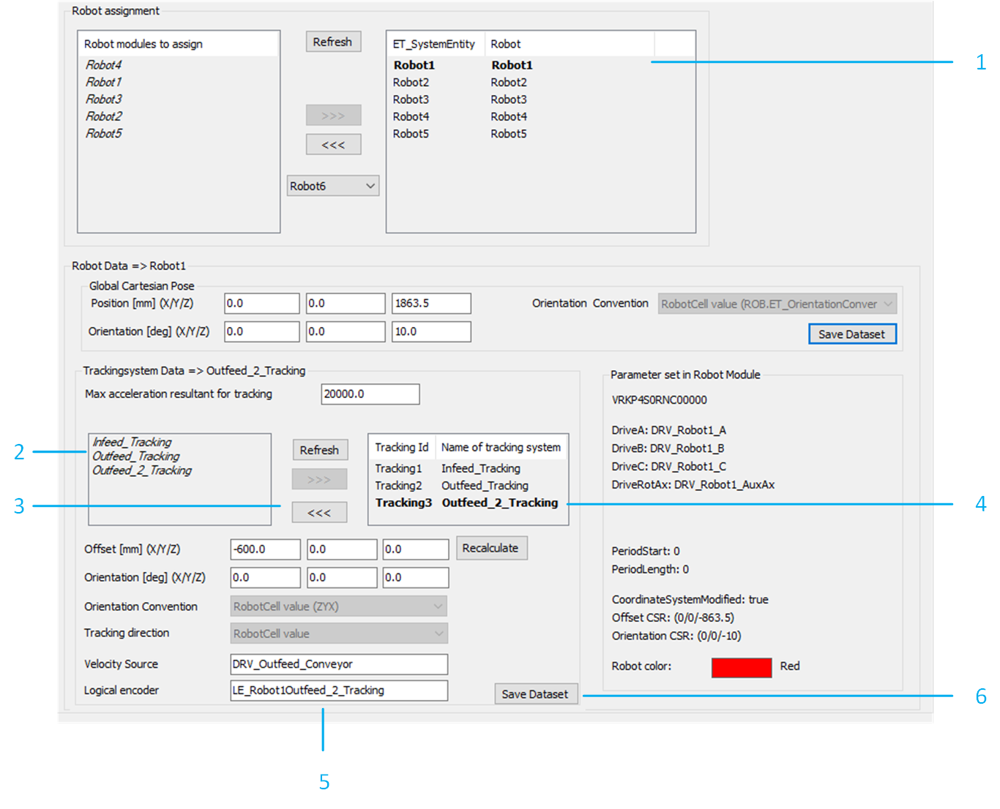

# Adding a Tracking System

## Conveyor

Add a conveyor, if necessary. For details, refer to [Adding a Conveyor](AddingAConveyor-9D4ED2F1.html).

NOTE: As an alternative, an existing conveyor can be used to configure a new tracking system, depending on the needs of the application.

## Targets Handler

To assign the targets handler, proceed as follows:

In the RobotCell modules editor, select Configuration data > Targets Handler.

| Step | Action |
| --- | --- |
| 1 | Enter a unique name for the new targets handler in the Name field. |
| 2 | Click >>> to add the targets handler to the RobotCell.  **Result**: The targets handler is added to the list with a univocal ID value. |
| 3 | Select the previously added targets handler from the list. |
| 4 | Verify that the values of Get data from and Velocity Source are valid. |
| 5 | If required, select or deselect Disable encoder check, Automatically remove targets, and Set encoder parameters. |
| 6 | Click Save Dataset to store the data. |

## Sensor

To add a sensor to your example project, proceed as follows:

| Step | Action |
| --- | --- |
| 1 | Copy and paste one of the existing sensors under the desired RobotCell object.  **Result:** A new sensor module object is created.  NOTE: If required, it is possible to use one or more camera modules as an alternative to the sensor modules used by the example project. |

## Targets Generator

To assign the targets generator to the corresponding sensor, proceed as follows:

In the RobotCell modules editor, select Configuration data > Targets Generator.

| Step | Action |
| --- | --- |
| 1 | Select a sensor from the list under Targets Generator assignment. |
| 2 | Click >>> to add the targets handler to the RobotCell.  **Result**: The targets handler is added to the list with a univocal ID value. |
| 3 | Select the previously added targets handler from the list. |
| 4 | Verify the values of the Cartesian Pose.  NOTE: You can refer those coordinates either to the global coordinate system or a conveyor. |
| 5 | Click Save Dataset to store the data. |

NOTE: If a targets handler is already created for the new tracking system, then it can be select from the list so that every time a new target is generated it is automatically added to the targets handler.

## Tracking System

To assign the tracking system, proceed as follows:

In the RobotCell modules editor, select Configuration data > Tracking Systems.

| Step | Action |
| --- | --- |
| 1 | Enter a unique name for the new tracking system in the Name field. |
| 2 | Click >>> to add the tracking system to the RobotCell.  **Result**: The tracking system is added to the list with a univocal ID value. |
| 3 | Select the previously added tracking system from the list. |
| 4 | Verify that the values of the Moving System, Velocity Source, and Target Generators are valid. |
| 5 | Click Save Dataset to store the data. |

## Robot Tracking Configuration

To configure the tracking system, proceed as follows:

In the RobotCell modules editor, select Configuration data > Robots.

| Step | Action |
| --- | --- |
| 1 | Select the robot for which the new tracking system should be configured. |
| 2 | Select the tracking system to add to the selected robot. |
| 3 | Click >>> to add the tracking system to the list of configured tracking systems. |
| 4 | Select the previously added tracking system from the list. |
| 5 | Verify that the values are valid.  NOTE: The values are automatically generated based on the current layout of the RobotCell. |
| 6 | Click Save Dataset to store the data. |

NOTE: It is possible to verify the new layout of the RobotCell in the 3D Layout tab of the RobotCell object.

## Additional Considerations

Additional points to consider are the following:

* Ensure that the tracking system is considered by the pick and place logic. This can be verified in the method RobotCell.Init\_Supervisor by verifying the parameters of G\_astRoboticCellTargetSelection and either G\_astRoboticCellPickSearchLogic or G\_astRoboticCellPlaceSearchLogic, depending on the tracking system being an infeed or outfeed system.
* Ensure that the tracking system is considered by the balancing strategies. This can be verified in the method RobotCell.Init\_Balancing.
* Ensure that the constraints for the workspace calculation included in the example project are properly set in the method RobotCell.Init\_RobotData. This can be verified by reviewing the parameters of G\_astRobotSupervisionInterface[i\_etRobotId].stPickPlaceConstraints.stTracking.astConstraints, G\_aalrRobotWorkspaceMinimumWidth and G\_aalrRobotWorkspaceTrackingDistanceMargin.

EIO0000005357.00