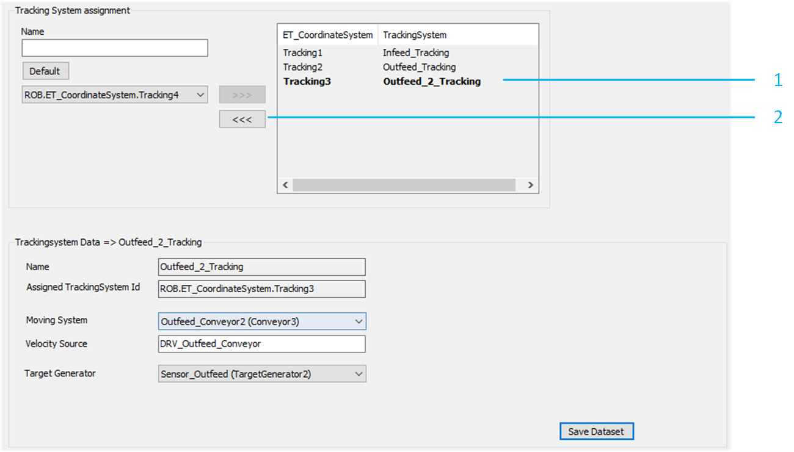
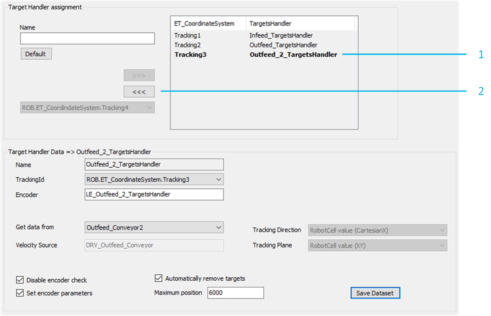
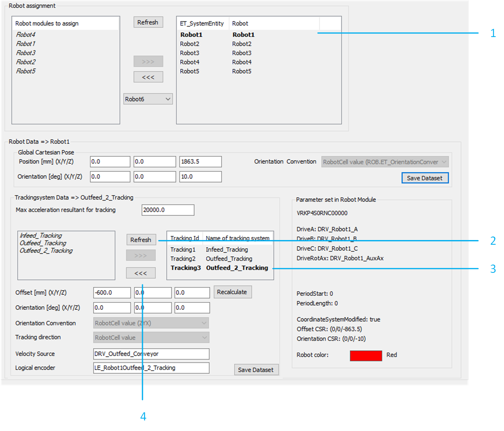

# Removing a Tracking System

## Tracking Systems

To remove the tracking systems, proceed as follows:

In the RobotCell modules editor, select Configuration data > Tracking Systems. Select the tracking system to remove from the list on the right-hand side.

| Step | Action |
| --- | --- |
| 1 | Click <<< to remove the selected tracking system from the RobotCell. |
| 2 | In the Removing Tracking Systems dialog box, confirm with Yes. |

NOTE: It is possible to verify the new layout of the RobotCell in the 3D Layout tab of the RobotCell object.

## Targets Handler

To remove each targets handler that was linked to the removed tracking system, proceed as follows:

In the RobotCell modules editor, select Configuration data > Targets Handler. Select the targets handler to remove from the list on the right-hand side.

| Step | Action |
| --- | --- |
| 1 | Click <<< to remove the selected targets handler from the RobotCell. |
| 2 | In the Removing Targets Handler dialog box, confirm with Yes. |

## Robot Tracking

To remove each robot for which at least one of the removed tracking systems was configured, proceed as follows:

In the RobotCell modules editor, select Configuration data > Robots. Select a robot for which one or more of the removed tracking systems were configured.

| Step | Action |
| --- | --- |
| 1 | Click Refresh to update the list on the left-hand side. |
| 2 | Select one of the removed tracking systems from the list on the right-hand side. |
| 3 | Click <<< to remove the selected tracking system from the configuration of the selected robot. |
| 4 | In the Removing SmartTemplate Module from RobotCell dialog box, confirm with Yes. |

NOTE: It is possible to verify the new layout of the RobotCell in the 3D Layout tab of the RobotCell object.

## Additional Considerations

Additional points to consider:

* Ensure that none of the removed tracking systems are still considered by the pick and place logic. This can be verified in the method RobotCell.Init\_Supervisor by verifying the parameters G\_astRoboticCellTargetSelection, G\_astRoboticCellPickSearchLogic and G\_astRoboticCellPlaceSearchLogic .
* Ensure that none of the removed tracking systems are still considered by the balancing strategies. This can be verified in the method RobotCell.Init\_Balancing.

EIO0000005357.00