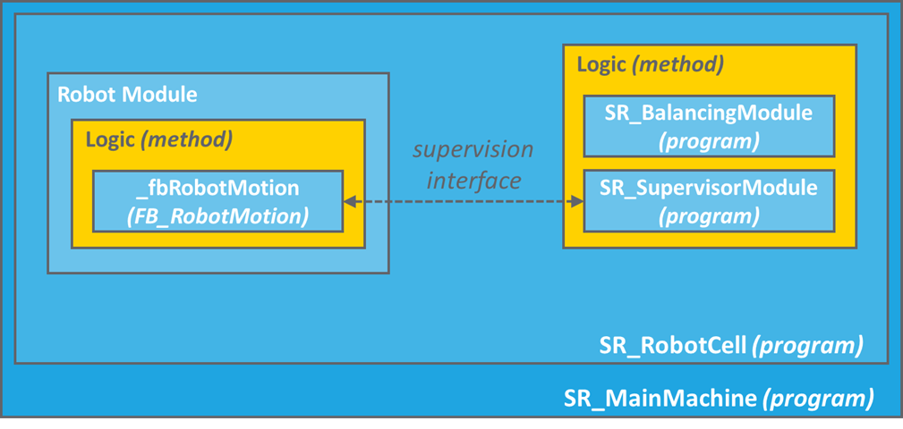

# Supervision Interface

## Overview

A structure called ST\_RobotSupervisionInterface is exchanged between the Supervisor Module and each Robot Module. An array of ST\_RobotSupervisionInterface is available as a global variable under RoboticCellMonitoring.G\_astRobotSupervisionInterface.

The Supervision Interface contains:

| Parameter | Description |
| --- | --- |
| stEntityData | Description of a robot entity. |
| stInitialization | The parameters used to initialize the robot. |
| stSoftwareLimits | The parameterization of the software limits. |
| stMotionParameters | The motion parameterization of the actions provided by the robot (for example pick target, place target, etc.). |
| stPickPlaceConstraints | A set of constraints for each coordinate system on which the robot must operate. |
| stTaskInterface | An interface used to exchange commands and status information between supervisor and robot. |

The Smart Template  initializes the entities and most of the configuration parameters through user interface. Then, inside the project, the function block FB\_ConfigurationDataHandler  retrieves the configured data and automatically fills the structures stEntityData, stInitialization, and stSoftwareLimits in the Supervision Interface. The information are then available in the code.

The structures stMotionParameters and stPickPlaceConstraints  are initialized in the Smart Template  module RobotCell by the methods Init\_RobotData and Init\_RobotsWorkspaces.

The structure stTaskInterface is used in the SR\_SupervisorModule.Logic, where the logic of the RobotCell is implemented.

EIO0000005357.00