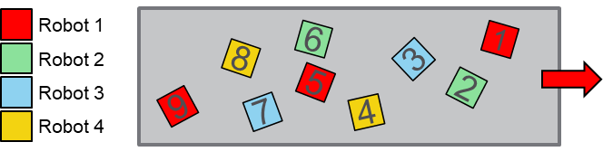

# Balancing Strategies

## Overview

The balancing strategies are used to balance the workload between two or more robots inside a RobotCell. The demo project contains the global variable RoboticCellMonitoring.G\_astRoboticCellBalancing that allows to select and configure a balancing strategy for each tracking system. This variable can be edited during the runtime to affect the behavior of a RobotCell.



In the demo project, the balancing strategies of the tracking systems are initialized in the Smart Template module RobotCell by the method Init\_Balancing.

## Example Code

The following example shows how to configure a List balancing strategy for the tracking system Tracking1:

```
//select the ID of the tracking system
etTrackingSystem := ROB.ET_CoordinateSystem.Tracking1;
//select a default balancing strategy
G_astRoboticCellBalancing[etTrackingSystem].etStrategy := ET_RobotBalancingStrategy.List;
//configure the List strategy
G_astRoboticCellBalancing[etTrackingSystem].stList.aetRobotList[1] := SERT.ET_SystemEntity.Robot1;
G_astRoboticCellBalancing[etTrackingSystem].stList.aetRobotList[2] := SERT.ET_SystemEntity.Robot2;
G_astRoboticCellBalancing[etTrackingSystem].stList.aetRobotList[3] := SERT.ET_SystemEntity.Robot3;
G_astRoboticCellBalancing[etTrackingSystem].stList.aetRobotList[4] := SERT.ET_SystemEntity.Robot4;
G_astRoboticCellBalancing[etTrackingSystem].stList.udiNumberOfRobots := 4;
G_astRoboticCellBalancing[etTrackingSystem].stList.udiMaxNumberOfAssignmentsPerCall := 10;
G_astRoboticCellBalancing[etTrackingSystem].stList.xAssignNextOwner := TRUE;
```

For further information, refer to [SERT.IF\_BalancingStrategy](../../../../../api/crossBook?lang=en-US&virtualBookName=SERToolb&topicID=D_SE_0098021).

EIO0000005357.00