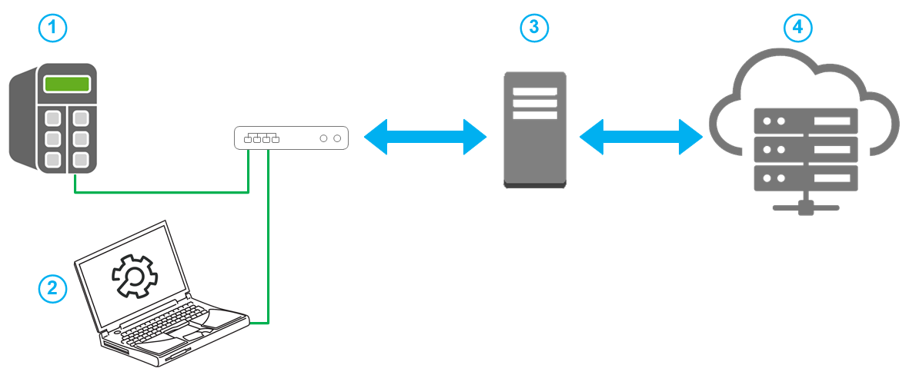

# Overview of the Hardware Configuration

## Overview

To run the application example, the following hardware installation was tested:

**1** Controller

**2** PC with EcoStruxure Machine Expert

**3** Proxy Server (Forward-Proxy)

**4** Public MQTT broker, for example test.mosquitto.org

EIO0000003442.02

© 2022

Schneider Electric.

All rights reserved.