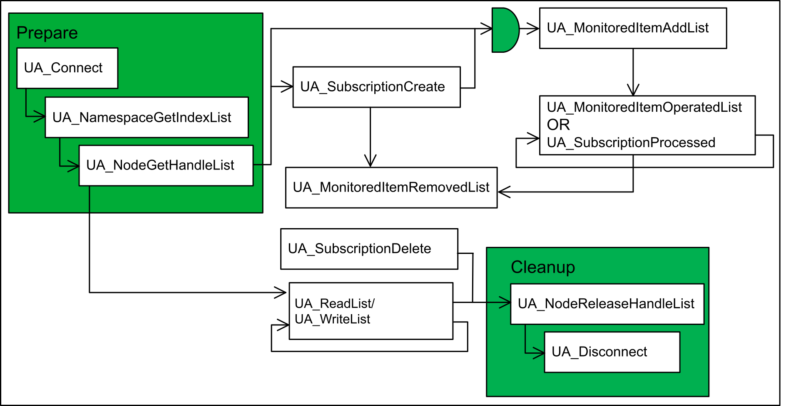
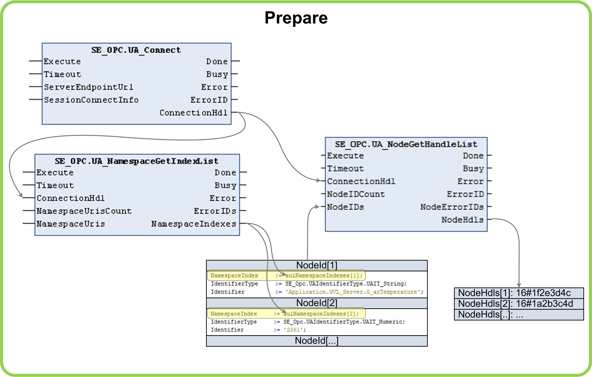
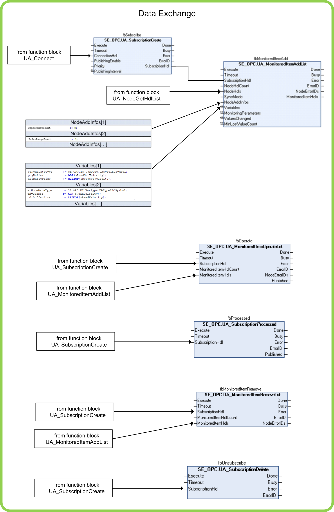
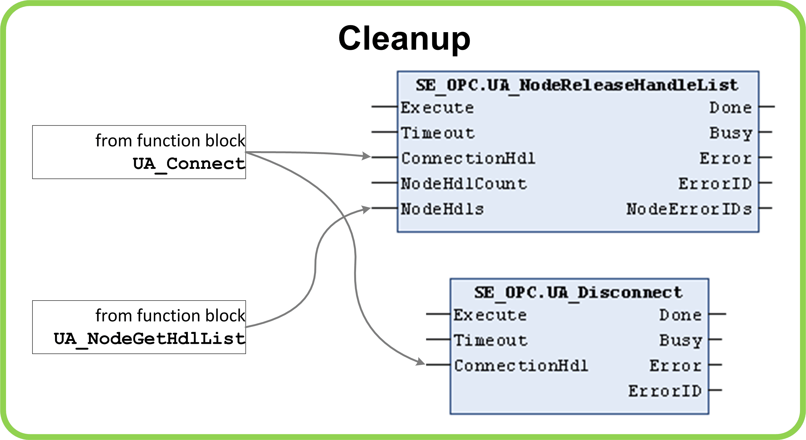

# Program Organization Units (POUs)

## SR\_OpcUaHandling

The program SR\_OpcUaHandling implements the program code to control the OPC UA client.

The program implements a state machine for execution of the sequence (refer to diagram below) of the function block calls for reading and/or writing lists of variables, and subscribing and monitoring items.

| Function block / step | Description |
| --- | --- |
| UA\_Connect | With the function block UA\_Connect, the transport connection and the OPC UA session to the OPC UA server is established. The function block requires the endpoint URL of the server and additional connection parameter regarding security settings, authentication, timeouts, and so on. After the connection has been established successfully, the connection handle is provided which is required by subsequent called function blocks. |
| UA\_SubscriptionCreate | With the function block UA\_SubscriptionCreate, a subscription can be created. The function block requires the corresponding connection handle. |
| UA\_SubscriptionDelete | With the function block UA\_SubscriptionDelete, a subscription can be deleted. The function block requires the corresponding subscription handle. |
| UA\_MonitoredItemAddList | With the function block UA\_MonitoredItemAddList, monitored items can be added to a subscription using the corresponding subscription handle and the list of node handles. Depending on the configured synchronization mode, the values for each node are written to variables in your application automatically or triggered by the application. The variables must be provided to the function blocks via a list of variable references. |
| UA\_MonitoredItemDeleteList | With the function block UA\_MonitoredItemDeleteList, monitored items can be deleted from a subscription using the corresponding subscription handle and the list of node handles. Deleting all monitored items prior to the execution of UA\_SubscriptionDelete is not mandatory because UA\_SubscriptionDelete forces a clean-up of the subscription. |
| UA\_MonitoredItemOperateList | With the function block UA\_MonitoredItemOperateList, the values of multiple monitored items out of one subscription using the corresponding subscription handle and a list of monitored item handles can be updated. This function block can only be called using the controller synchronization mode. |
| UA\_SubscriptionProcessed | With the function block UA\_SubscriptionProcessed, it is verified that at least one value of the subscription is updated. The function block requires the subscription handle. This function block can only be called using the firmware synchronization mode. |
| UA\_NamespaceGetIndexList | With the function block UA\_NamespaceGetIndexList, the namespace indexes for the namespaces of interest must be retrieved from the server. The function block requires the connection handle and a list of namespaces of interest. The retrieved namespace indexes must be assigned to the corresponding node Ids, which are required by the function block UA\_NodeGetHandleList. |
| UA\_NodGetHandleList | With the function block UA\_NodeGetHandleList, the handles for the nodes of interest must be retrieved from the OPC UA client. The function block requires the connection handle and a list of node Ids of interest. The retrieved node handles are required by the function blocks UA\_ReadList and UA\_WriteList. |
| UA\_ReadList / UA\_WriteList | With the function blocks UA\_ReadList and UA\_WriteList, the data exchange based on a list of node handles is implemented. The function blocks require the connection handle and a list of node handles so that their values can be read or written. The values for each node are read from or written to variables in your application. The variables must be provided to the function blocks via a list of variable references. |
| UA\_ConnectionGetStatus | With the function block UA\_ConnectionGetStatus, the status of the connection can be retrieved. The function block requires the corresponding connection handle. |
| UA\_NodeReleaseHandleList | With the function block UA\_NodeReleaseHandleList, a list of node handles is released in the OPC UA client. Only if all node handles which have been retrieved before are released, a new list of node handles can be queried using the function block UA\_NodeGetHandleList. The function block requires the connection handle and a list of node handles which that are to be released. Releasing all node handles prior to the execution of UA\_Disconnect is not mandatory because the UA\_Disconnect forces a clean-up of the OPC UA client in general. |
| UA\_Disconnect | With the function block UA\_Disconnect, the connection to the OPC UA server is closed. The function block requires the connection handle of the connection which shall be closed. |

The program code has been divided into single logical functions. The single program parts are processed in subroutines, referred to as actions.

The actions called from the program are listed in the following table:

| Name of the subroutine (action) | Description |
| --- | --- |
| ACT\_ConfigConnect | This logic is used to configure the function block UA\_Connect. |
| ACT\_ConfigMonitoredItemAddList | This logic is used to configure the function block UA\_MonitoredItemAddList. |
| ACT\_ConfigNamespaceGetIndexList | This logic is used to configure the function block UA\_NamespaceGetIndexList. |
| ACT\_ConfigNodeGetHandleList | This logic is used to configure the function block UA\_NodGetHandleList. |
| ACT\_ConfigReadList | This logic is used to configure the function block UA\_ReadList. |
| ACT\_ConfigWriteList | This logic is used to configure the function block UA\_WriteList. |
| ACT\_Cleanup | This logic implements the part of the state machine which handles the cleanup of the OPC UA client.  The processed states are:   * Release node handles for variables to read and to write. * Disconnect from OPC UA server. |
| ACT\_DetectCommands | In this logic, the commands triggered by the visualization are detected and the flags to control the state machine are set. |
| ACT\_HandleDataExchangeCommands | In this logic, the state machine inside `ACT_StateMachine` is controlled depending on the commands detected in `ACT_DetectCommands`. |
| ACT\_HideTokenParam | In this logic, the token parameters displayed on the visualization are set. |
| ACT\_Init | This logic is called only during the very first cycle. It implements the initialization of static parameters. |
| ACT\_InputMapping | In this logic, the configuration data and other input variables, mainly coming from the visualization, are verified and assigned to local variables for further processing. |
| ACT\_OutputMapping | In this logic, the output variables, mainly designated to the visualization, are verified and assigned to variables declared inside GVL\_Visu for further processing. |
| ACT\_Prepare | This logic implements the part of the state machine, which handles the preparation of the OPC UA client.  The general states are:   * Connect to OPC UA server. * Get namespace indexes. * Get node handles for variables to read and to write. |
| ACT\_Reset | This subroutine is executed after an error was detected or disconnection. Herein all internal variables are initialized. |
| ACT\_StateMachine | This logic implements the state machine for the operation of the OPC UA client.  The general states are:   * Call the subroutine ACT\_Prepare. * Read variables from OPC UA server. * Write variables to OPC UA server.    + Create a subscription.   + Add monitored items to subscription.   + Delete monitored items from subscription.   + Delete a subscription.   + Verify whether values of the monitored items are published.   + Operate monitored items to update values. * Call the subroutine ACT\_Cleanup. * Error handling. |

## SR\_SimulatedMachineData

The program SR\_SimulatedMachineData implements the program code to simulate values for variables which are provided by the OPC UA server.

## SR\_FirewallConfig

The program SR\_FirewallConfig calls the corresponding program to configure the controller firewall depending on the controller:

* On Modicon M262 controllers, the called program implements the dynamic configuration of the controller firewall.

After a warmstart of the application, the firewall of the controller is configured such that the protocols Modbus Server, SNMP, Web Server (HTTP) and WebVisualization (HTTP) received on either Ethernet ports are rejected.

* On PacDrive LMC controllers, the called program can be extended to modify the controller firewall settings. Otherwise, the default settings for the controller firewall are left unchanged.

EIO0000004099.03