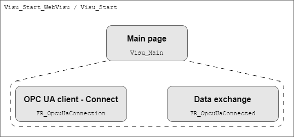
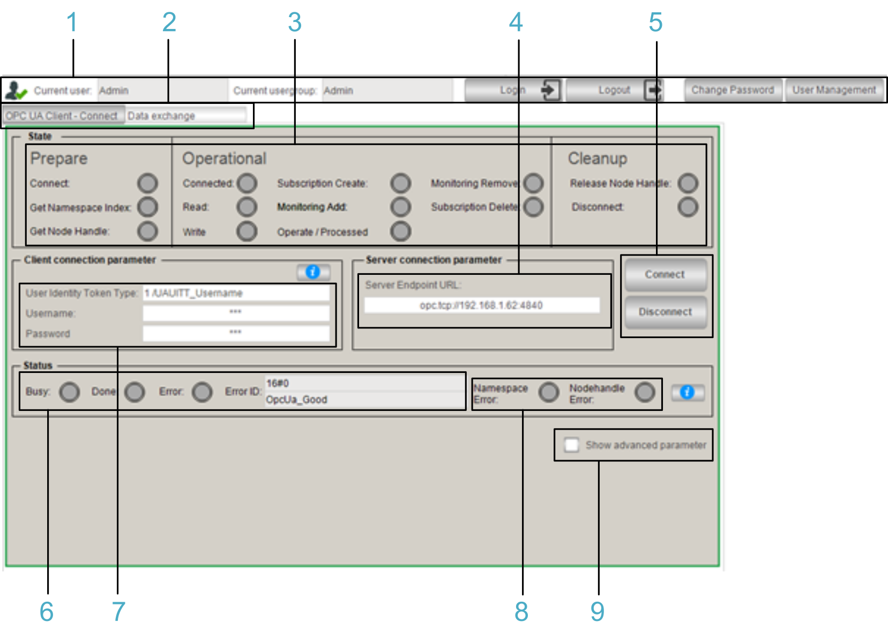
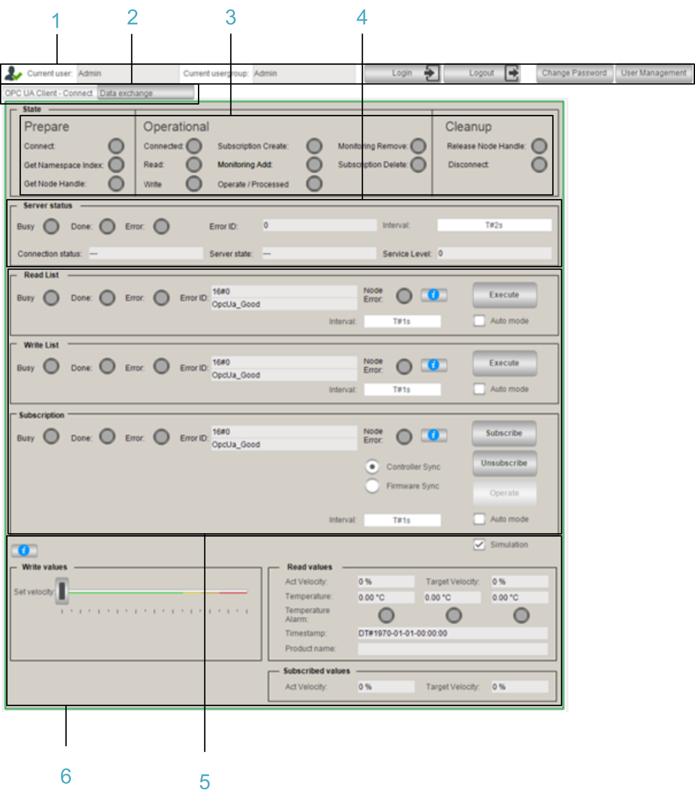

# Visualization Screens

## Overview

The application example implements a visualization in the Logic Builder that can be used to control and monitor the application. Two visualization screens are provided which can be switched from the Visu\_Main.

The visualization also exists as web visualization.

With the web visualization, you have access to machine control functions over the network. To prevent unauthorized access to your machine control, perform the following technical and organizational measures for the system on which your application is running.

| WARNING | |
| --- | --- |
|  | UNAUTHENTICATED, UNAUTHORIZED ACCESS  * Do not expose controllers and controller networks to public networks and the Internet as much as possible. * Use additional security layers, such as VPN, for remote access and install firewall mechanisms. * Restrict access to authorized personnel by activation and deployment of the user management of the controller and the visualization. * Change default passwords at start-up and modify them frequently. * Validate the effectiveness of these measurements regularly and frequently.  Failure to follow these instructions can result in death, serious injury, or equipment damage. |

## Login Page

Visu\_Login

Enter Username and Password and click LOGIN to access the visualization.

## OPC UA Client - Connect

Visu\_Main > OPC UA Client - Connect

**1** User management

**2** Tabs to switch the visualization panel

**3** Indicates the status of the OPC UA client.

**4** Server URL of the OPC UA server to connect.

**5** Buttons to trigger a connect or disconnect procedure.

**6** Indicates the status of the triggered connect or disconnect procedure.

**7** Allows you to provide the authentication parameters to connect to the OPC UA server.

**8** Indicates that an error was detected while getting the namespace or the node handles. For further information, refer to the declaration part of the [program SR\_OpcUaHandling](D-SE-0101412.html#D-SE-0101412__D-SE-0101412.2).

**9** Allows you to configure additional connection parameters.

## Data Exchange

Visu\_Main > Data exchange

**1** User management

**2** Tabs to switch the visualization panel

**3** Indicates the status of the OPC UA client.

**4** Cyclically indicates the connection status.

**5** Allows you to read and write a list of variables and to create a subscription to monitor a list of items. The configuration of the function block and the variables is performed in the corresponding program ACT\_Config•••.

**6** Simulation to illustrate the data exchange between the client and the server.

EIO0000004099.03