# General Adaptions

## Replacing PacDriveLib Functionalities

The function block FC\_MultiConcat is part of the Common Toolbox library (SE\_CTBX).

**Example:**

Replace PDL.FC\_MultiConcat by SE\_CTBX.FC\_MultiConcat in the entire project.

For more information, refer to the [*Conversion Table for Tool Functions, (Compatibility and Migration - User Guide)*](../../../../../api/crossBook?lang=en-US&virtualBookName=CompMigr&topicID=3D6CF2D1) .

## Replacing Namespaces

Rename the namespaces from the libraries by renaming the function blocks.

NOTE: The project uses open source function blocks, which are based on PLCOpen function blocks.

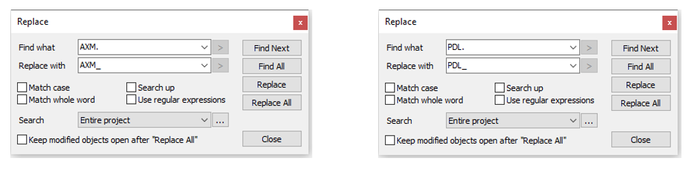

## Replacing IF\_Master

In order to access the axis parameters, you must modify the interface.

For One Motion Kernel based controller, replace the interface IF\_Master by IF\_Axis from the Motion Interface library.

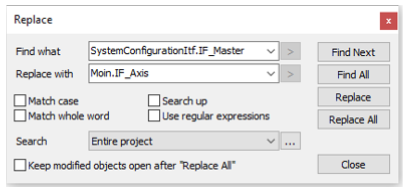

## Replacing ST\_ExampleLeafModuleInterface

In the structure ST\_ExampleLeafModuleInterface, replace the input type ST\_ExampleLeafModuleInterface by Moin.IF\_Axis.

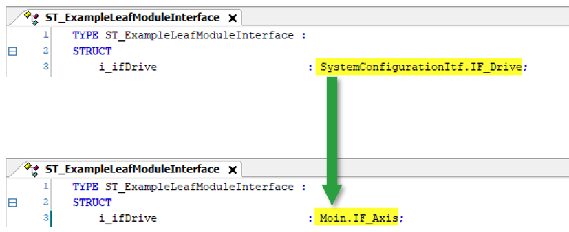

## Replacing DRV\_Master by DRV\_Master.Axis

In the program SR\_MainMachine.SubModules\_Action, replace the input type DRV\_Master by DRV\_Master.Axis.

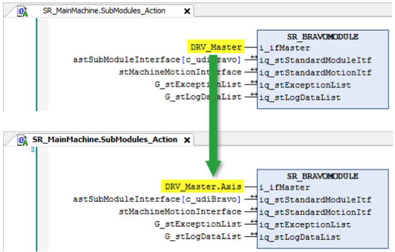

## Replacing DRV\_Master by Init\_Nocke

In the program SR\_CharlyModule.Init\_Nocke1, replace the input DRV\_Master by the interface within Init\_Nocke.

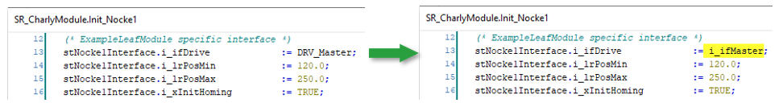

## Deleting the Reference to Master

In the program SR\_AphaModule, comment out the reference to the master in every EquipmentModule.

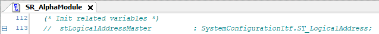

## Changing the Assignment from Drive Parameters to Inits

In the program SR\_AlphaModule.Init\_Master, change the assignment from Drive parameters to Inits.

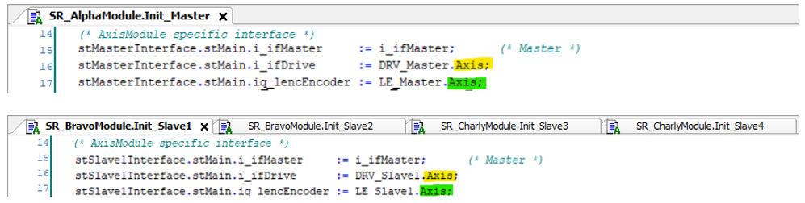

NOTE: With the interface Axis, you have access to the drive respective logical encoder parameter.

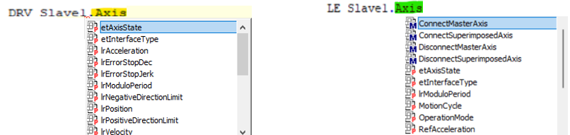

## Replacing the Parameters ControllerStopDec and ControllerStopJerk

In the program SR\_AlphaModule.Init\_Master, replace the parameter  ControllerStopDec and ControllerStopJerk by the method SetErrorStopRamp.

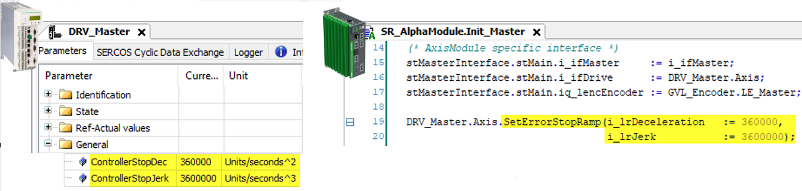

## Deleting the Function FC\_ObjectTypeIsMotionAxis

Copy the functions FC\_IsDriveVirtual and FC\_SetDeatTimeCompensation from the Migration\_Demoproject to your project. In addition delete the function FC\_ObjectTypeIsMotionAxis.

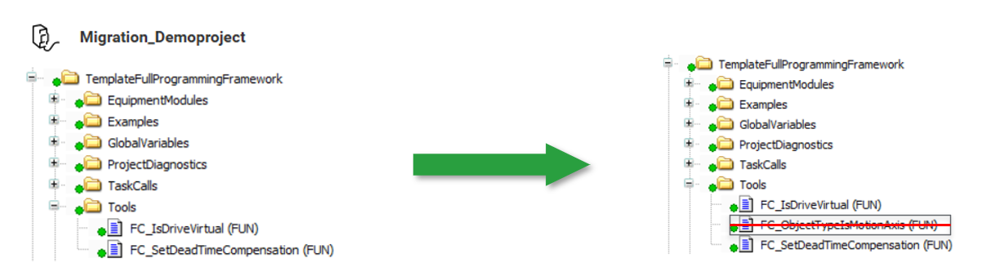

## Available Homing Modes

All homing modes except MaxForceModes are supported.

```
TYPE PDL_ET_HomeMode :
(
    PosDirectionPosEdgeTp  :=0
    NegDirectionPosEdgeTp  :=1
    NegDirectionNegEdgeTp  :=2
    PosDirectionNegEdgeTp  :=3
    PosDirectionPosEdgeSensor  :=4
    NegDirectionPosEdgeSensor  :=5
    NegDirectionNegEdgeSensor  :=6
    PosDirectionNegEdgeSensor  :=7
    PosDirectionPosEdgeHWLimitPos  :=8
    NegDirectionPosEdgeHWLimitNeg  :=9
    NegDirectionNegEdgeHWLimitNeg  :=10
    PosDirectionNegEdgeHWLimitPos  :=11
    PosDirectionMaxTorque  :=12
    NegDirectionMaxTorque  :=13
    Move OnPosAbs  :=14
    SetPosAxisPosition  :=15
    SetPosLogEncoderPosition  :=16
    SetPosAxisAndLogEncoderPosition  :=17
    RestorePosFromAxisEncoder  :=18
    RestorePosFromRetain  :=19
    WriteAxisEncoder  :=20
)UDINT;
END TYPE
```

## Touchprobe

There are no onboard touchprobes on the M660.

You must assign zero to i\_ifTouchprobe.

NOTE: Touchprobe objects are only available when adding EdgeIO hardware.

## Replacing the Function FC\_LzsTaskGetInterval

In SR\_AlphaModule.Init\_Master, replace the function FC\_LzsTaskGetInterval by G\_diTaskIntervalInMs.

In order to replace the function, you must first create the variables G\_diTaskIntervalInMs and pTaskInfo.

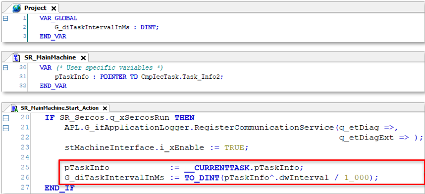

Replace the function FC\_LzsTaskGetInterval by G\_diTaskIntervalInMs in every Slave Int.

## Replace i\_xSetEncoderParameters

The parameter i\_xSetEncoderParameters is no longer necessary.

Modify the Inits of every axis (master and slaves).

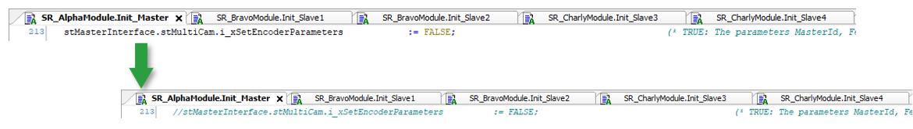

## Replace SYSTEMINTERFACE.ET\_PosMode.Endless

Replace the SYSTEMINTERFACE.ET\_PosMode.Endless by PDL\_ET\_PosMode.Endless in the Inits for every axis, and in the Logic\_Action of CharlyModule.

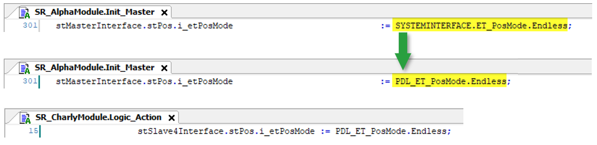

## Intelligent Line Shaft (ILS)

The Intelligent Line Shaft (ILS) version of FB\_EndlessFeed is not available.

In the SR\_VisControl, comment out the action DetectOpModeChange.

Comment out the global variables folder for the Intelligent Line Shaft.

EIO0000005892.01