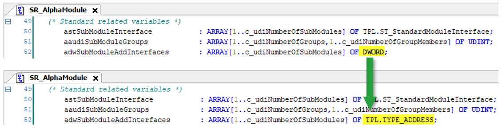

# Adaption from 32-bit System to 64-bit System

## Changing the DWORD Type

The M660 controller runs on a 64-bit system, whereby the LMC 32 runs on a 32-bit system. So it is necessary to replace the format of the DWORD type to prevent an incorrect display when using pointers (for example, by using SIZEOF(pdwArrayPos)).

Change the datatype from DWORD to TPL.Type\_Address

NOTE: Use the search functionality to find all locations of the parameter Adw.SubModuleAddInterfaces (Equipment modules and examples).

EIO0000005892.01