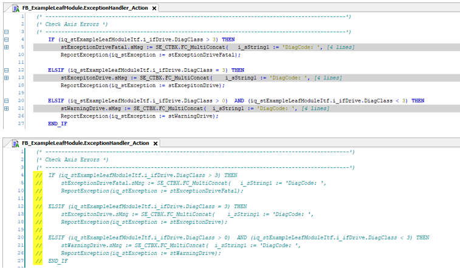
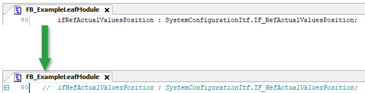
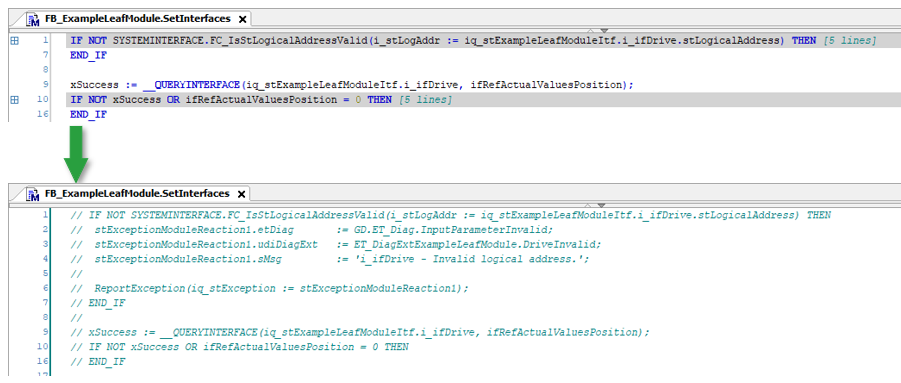
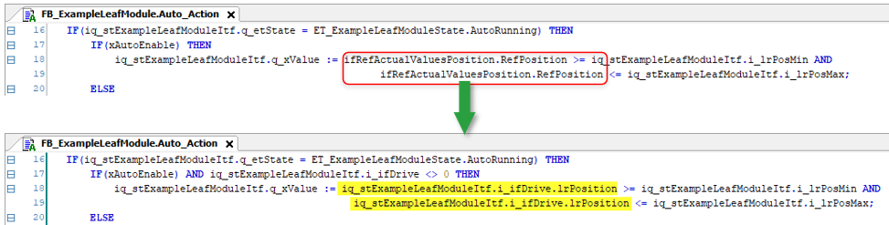
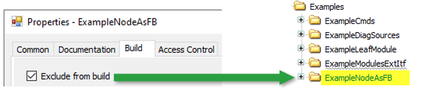

# Examples within Template

## Adjusting the Method ExceptionHandler\_Action

In the method FB\_ExampleLeafModule.ExceptionHandler\_Action, comment out the variables. 

## Removing ifRefActualValuesPosition

In the function block FB\_ExampleLeafModule, comment out the variable ifRefActualValuesPosition, as it is not used.

## Adjusting the Method SetInterfaces

In the method FB\_ExampleLeafModule.SetInterfaces, comment out the function SYSTEMINTERFACE.FC\_IsStLogicalAddressValid, as it is not used.

## Adjusting the Method Auto\_Action

In the method FB\_ExampleLeafModule.Auto\_Action, replace the variable ifRefActualValuesPosition.RefPosition by iq\_stExampleLeafModuleItf.i\_ifDrive. lrPosition.

## FB\_ExampleNodeAsFB

The usage of the function block FB\_ExampleNodeAsFB is optional and can be excluded from the project.

NOTE: To use this function block, you must apply the same adjustments as for the EquipmentModules function block.

EIO0000005892.01