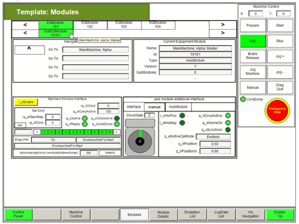

# Opening the Visualization

## Overview

The application example implements a visualization in the Logic Builder that can be used to control and monitor the application.

## Opening the Visualization

To open the visualization, use Vis\_Main > VModules

To start an operation mode within the visualization, proceed as follows:

| Step | Action |
| --- | --- |
| 1 | Open the Vis\_Modules visualization. |
| 2 | Enable the visualization by clicking the Enable Vis button. |
| 3 | Enable the track by clicking the Enable Track button. |
| 4 | Select the required mode by clicking the corresponding button, for example the Automatic Mode button. |
| 5 | Start the mode by clicking the Start button.  **Result:** The master axis runs in OpMode EndlessFeed.  The slave axis follows the master in MultiCam mode. |

EIO0000005892.01