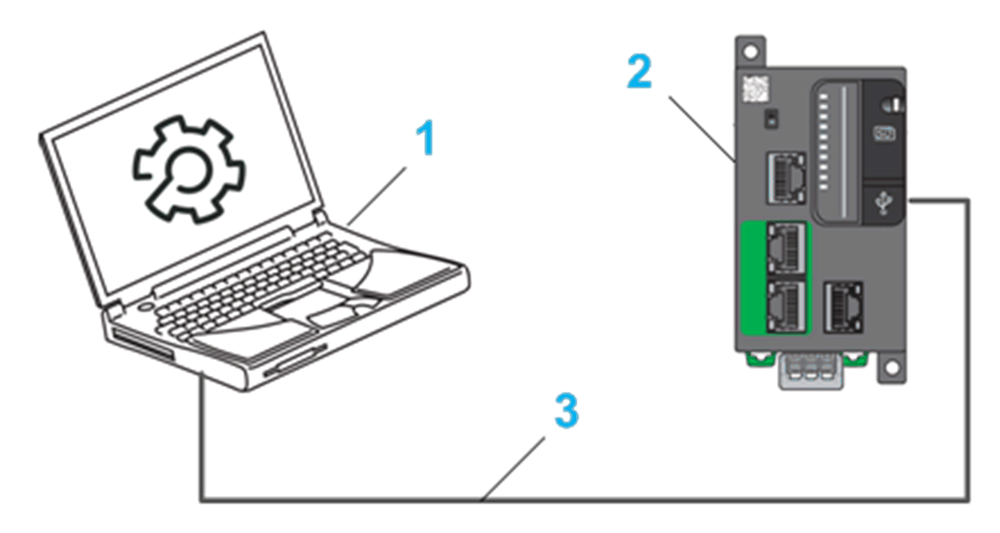

# Overview of the Hardware Configuration

## Overview

To run the application example, the following hardware installation was tested:

**1** PC with EcoStruxure Machine Expert and a running NTP or SNTP time server

**2** Logic controller TM251MESE

**3** Ethernet connection

NOTE: This example is using the Modicon M251 Logic Controller platform, but the principles are the same for other EcoStruxure Machine Expert controller platforms.

EIO0000002445.02

© 2021

Schneider Electric.

All rights reserved.