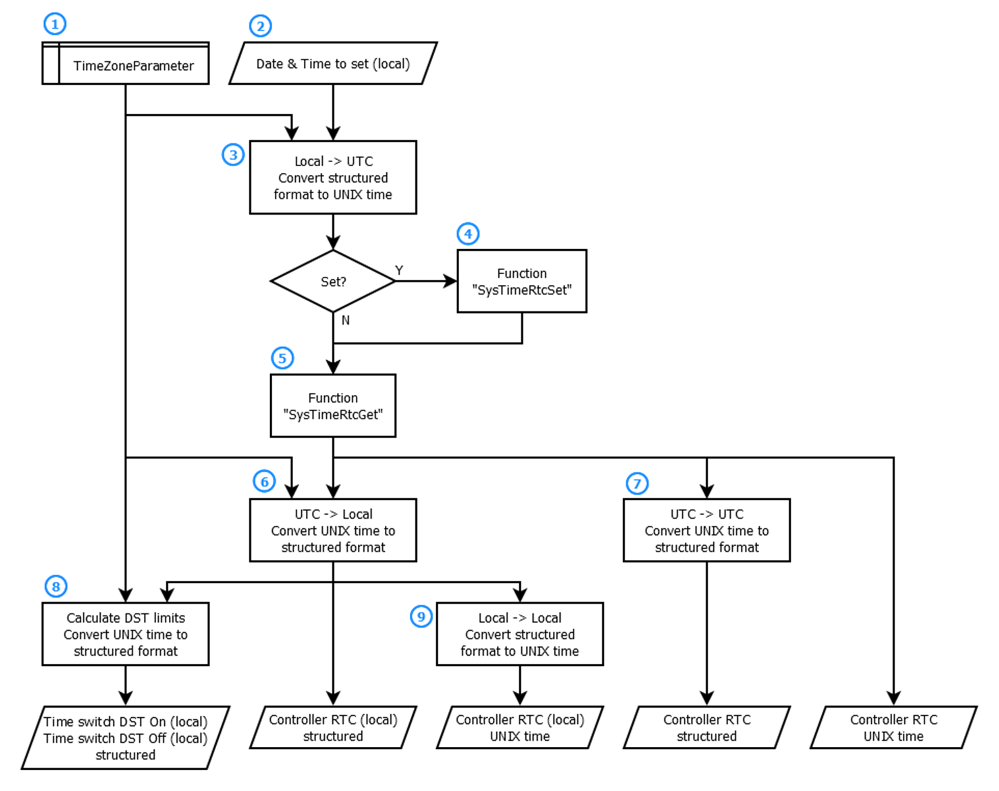

# Program Organization Units (POUs)

## `Prg_Main`

The program `Prg_Main` implements the execution of `Prg_RTC_Control` and `fbSntpClient` along with the assignment of the associated global variables to its input and output parameter. Further, the `Prg_Main` contains the program logic to set the weekly drift for the RTC (Real-Time Clock) of the controller. The `Prg_Main` itself is called cyclically within the MAST task.

## `Prg_RTC_Control`

The program `Prg_RTC_Control` implements the logic to control the RTC of the controller (including the timezone configuration) and provides input and output parameter so that the program can be called from another program.

The flowchart illustrates the running `Prg_RTC_Control` on a controller:

| Item | Description |
| --- | --- |
| 1 | The [timezone configuration parameter](D-SE-0077825.html#D-SE-0077825__D-SE-0077825.4) are stored in the non-volatile memory of the controller. The parameter set consists of:   * Standard bias to the UTC (Coordinated Universal Time) * Additional bias to the UTC during the DST (Daylight Saving Time) * Parameter for switching On and Off the DST    + Month, number of the Sunday of the month and hour when to switch.   NOTE: The value 0 represents the last Sunday of the month. |
| 2 | The operator or the application selects the Time to set (local) which shall be set for the RTC of the controller. |
| 3 | The time to set selected in Item 2 is converted to the UTC considering the timezone parameter with the use of the function `FC_LocalToUtc`. The function provides the time to set as time stamp in UNIX time format. |
| 4 | If the application detects a rising edge of the command triggered by the Set RTC button, the system function `SysTimeRtcSet` from the `SysTimeRtc` library is executed in order to set the RTC of the controller with the selected time to set from Item 2. |
| 5 | In every program cycle, the RTC of the controller is read by the system function `SysTimeRtcGet` from the `SysTimeRtc` library. The function provides the RTC as time stamp in UNIX time format. |
| 6 | The read RTC value from the controller is converted to the local time considering the timezone parameter with the use of the function `FC_UtcToLocal`. The function provides the local time in a structured and ergonomic format. |
| 7 | The read RTC value from the controller is converted into a structured and ergonomic format using the function `FC_DateTimeSplit`. |
| 8 | The switching limits for the daylight saving time are calculated for the current year using the function `FC_CreateDstParam`. The function provides the switching limits as UNIX time format. These are converted to a structured and ergonomic format with the use of the function `FC_DateTimeSplit`. |
| 9 | With the use of the function `FC_DateTimeConcat`, the local time is converted into the UNIX time format. |

EIO0000002445.02

© 2021

Schneider Electric.

All rights reserved.