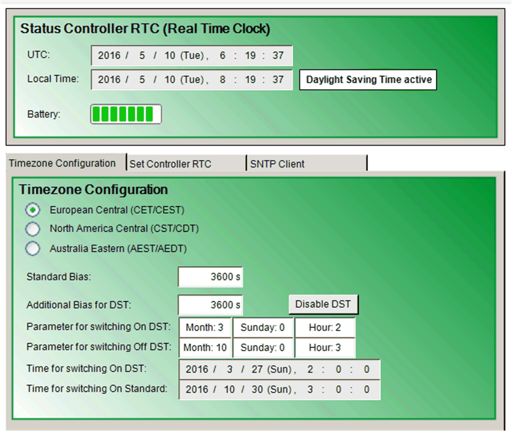
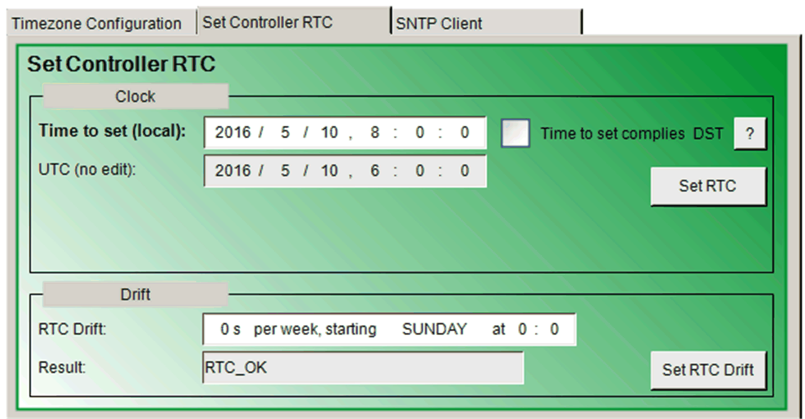
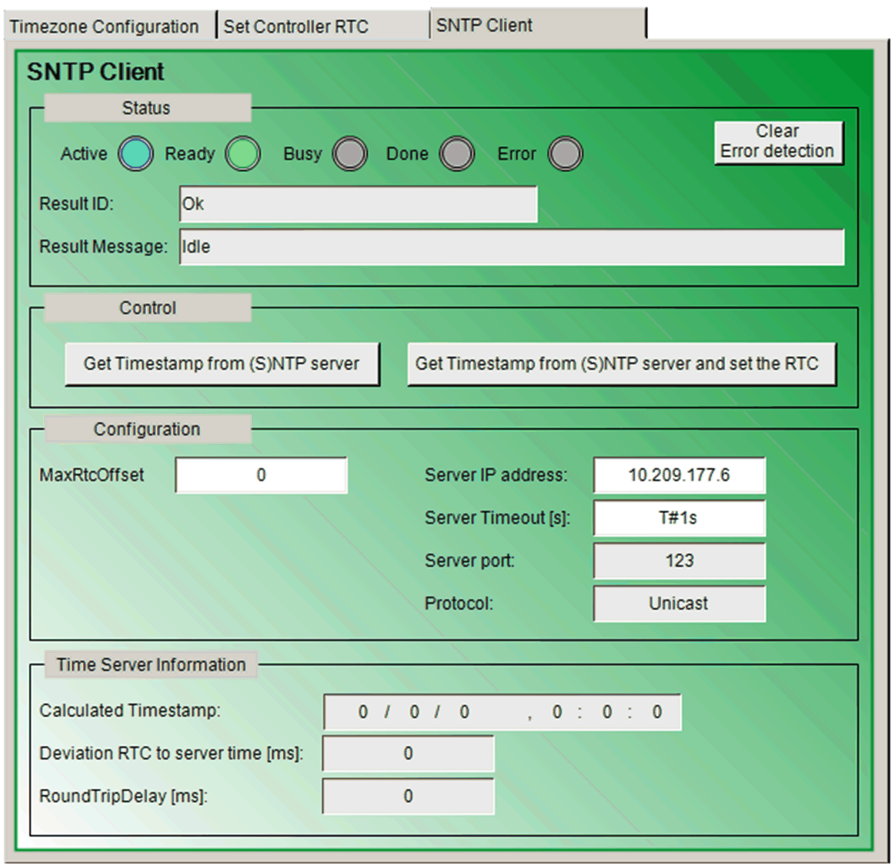

# Visualization Screens

## Overview

The application example implements a visualization which can be used to control and monitor the RTC (Real-Time Clock) of the controller in online mode. Beside the always visible display for the status of the RTC of the controller a tab control display is provided to switch between three RTC control screens.

## Timezone Configuration

Visu\_RTC\_Control > Timezone Configuration

## Set Controller RTC

Visu\_RTC\_Control > Set Controller RTC

## SNTP Client

Visu\_RTC\_Control > SNTP Client

EIO0000002445.02

© 2021

Schneider Electric.

All rights reserved.