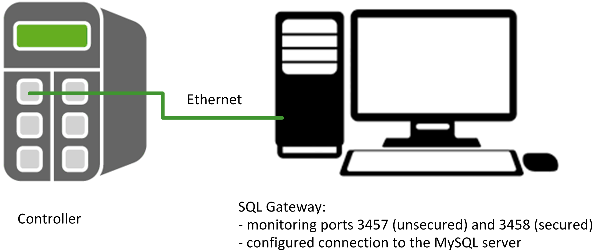

# Overview of the Hardware Configuration

## Overview

The project example implements one controller which is linked to the same network as the PC on which the SQL Gateway and the MySQL server are running.

NOTE: The MySQL server  can be running on another PC on the condition that the SQL Gateway can communicate with the MySQL server  wherever it is running.

The figure presents the layout of the network:

EIO0000002828.03

© 2021

Schneider Electric.

All rights reserved.