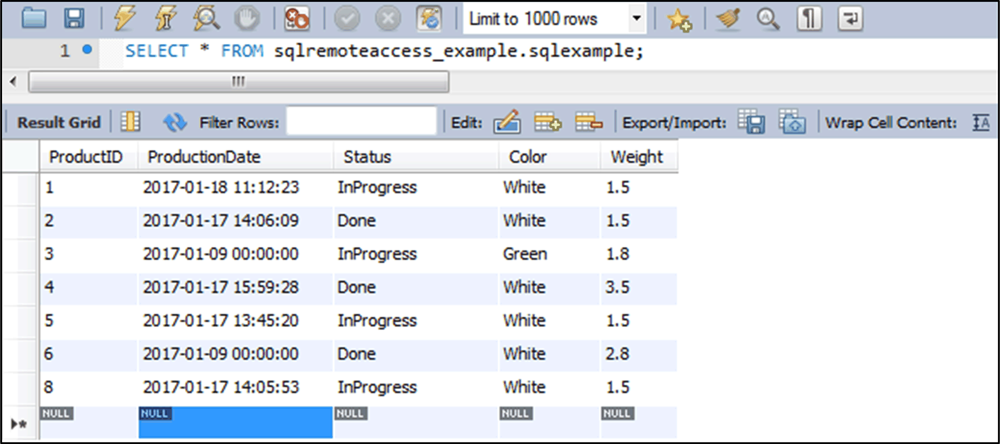

# MySQL Server

## Overview

For the application example, an SQL database and a corresponding schema are configured. The database is provided through the MySQL Server.

The name of the schema is `sqlremoteaccess_example`.

Further a table is created under the schema to provide an example of remote access from the controller application.

The name of the table is `sqlexample`.

## Database Table

The initially created fields are listed in the table:

| Column Name | Data type | Value example |
| --- | --- | --- |
| ProductID | INT(11) | 2 |
| ProductionDate | DateTime | 2017-01-17 14:06:09 |
| Status | VarChar(29) | InProgress |
| Color | VarChar(15) | White |
| Weight | Double | 1.5 |

## View in the MySQL Workbench

EIO0000002828.03

© 2021

Schneider Electric.

All rights reserved.