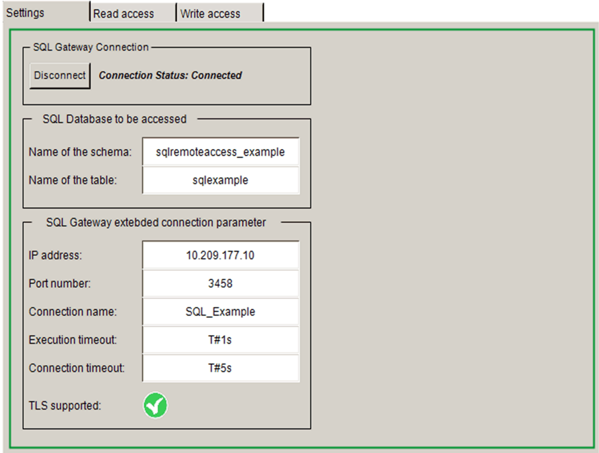
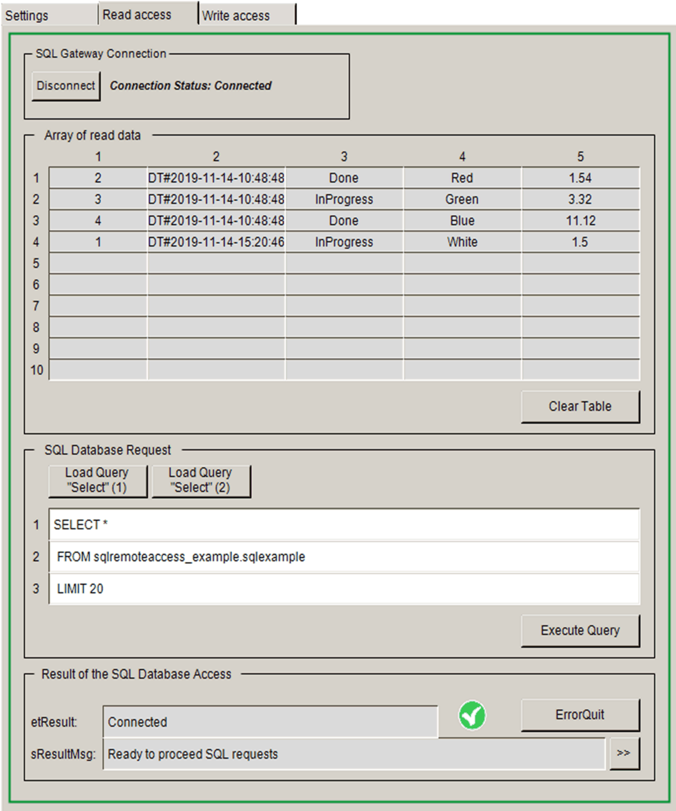
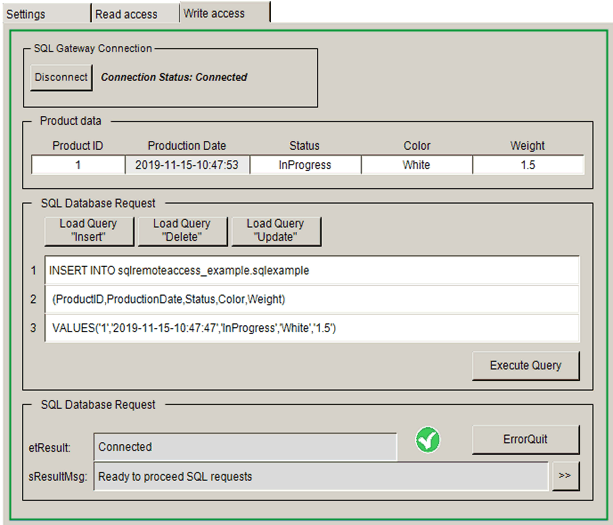

# Visualization Screens

## Overview

For each implemented communication function, a dedicated visualization screen is available. The visualization VisuStart contains a tab group that allows you to switch between the visualization screens.

## Visu\_SqlSettings

VisuStart > Settings

## Visu\_SqlRead

VisuStart > Read access

## Visu\_SqlWrite

VisuStart > Write access

EIO0000002828.03

© 2021

Schneider Electric.

All rights reserved.