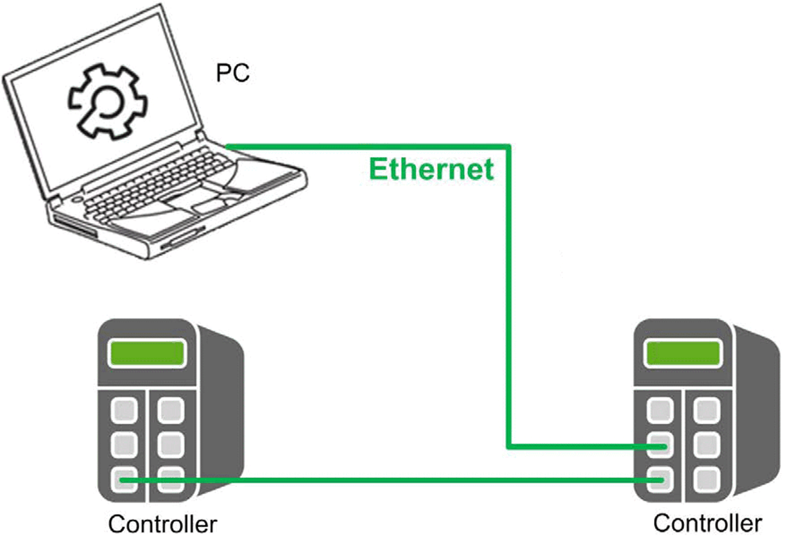

# Overview

Overview

The example project implements two controllers. To execute the example applications, the Ethernet setting of the [Ethernet](../glossary/glossary.htm#XREF_D_SE_0055638_7) interfaces for both controllers must be configured to comply with the requirements of the network.

The figures shows the layout of the network:

