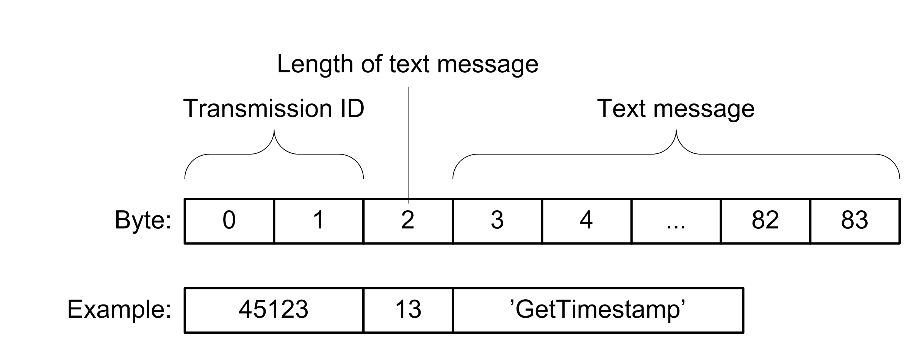

# Data Format

Data Format

For this example application, an application protocol format has been defined. It allows the application to verify the received data and to create the suitable response if a request for information has been received.

This simple protocol contains the following information:

oTransmission ID

oLength of the text message

oText message which represents the request command or the information

The figure illustrates the data format of the application protocol:

The table provides further information on the elements:

| Item of the protocol | Datatype | Description |
| --- | --- | --- |
| Transmission ID | UINT | The transmission ID is randomly generated by the TCP [client](../glossary/glossary.htm#XREF_D_SE_0055638_5).  It is sent back by the server in the response so that the client can verify the received data. |
| Length of text message | USINT | Indicates the length of the text message in bytes (number of characters + 1).  This allows the receiving site to verify the consistency of the data. |
| Text message | STRING[80] | The text message contains the application data. |