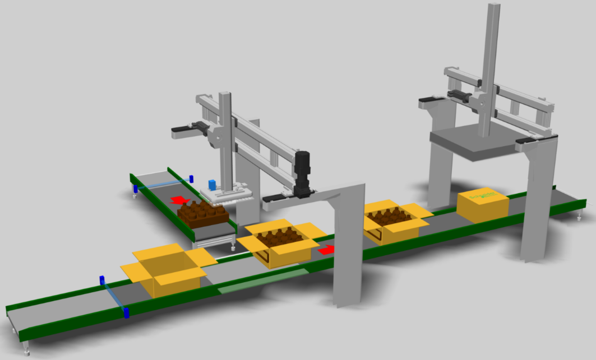

# Machine Purpose

The TopLoader machine serves as a simplified example of a process step typical for the packaging industry: placing products that are provided on one belt into cartons that are provided on another belt and subsequently sealing the cartons.

The TopLoader example project provides a solution to perform these tasks by using a clocked motion logic.

EIO0000005658.01