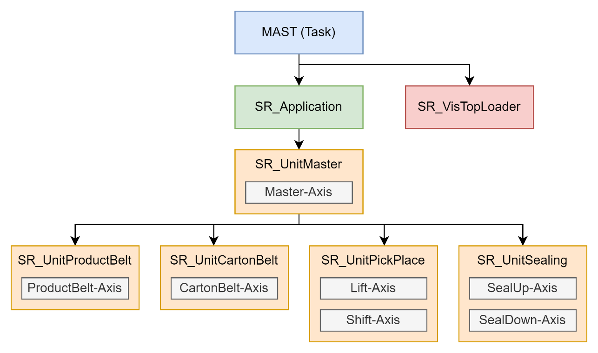
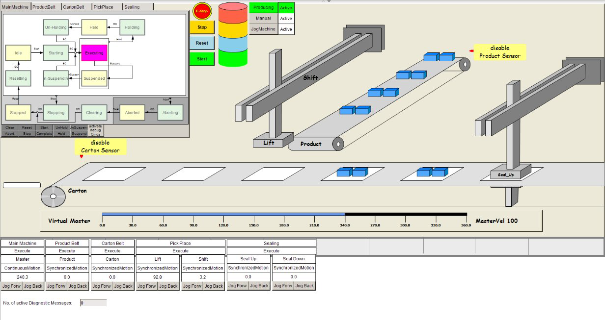
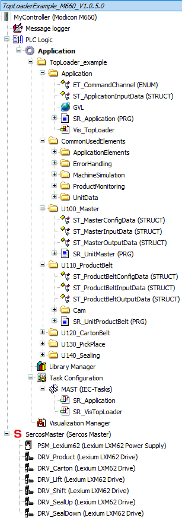

# Project Structure

## Overview of the TopLoader Project

The TopLoader project is executed in the default MAST task of the controller in the form of two programs:

* SR\_VisTopLoader
* SR\_Application

## SR\_VisTopLoader Program

The SR\_VisTopLoader performs the following application-specific tasks for the visualization displayed in the figure below:

* SR\_VisTopLoader provides calculations to move the isometric visualization of the TopLoader mechanic found in Vis\_TopLoader.
* SR\_VisTopLoader simulates the sensor values of the product sensor and the carton sensor. For further information on muting sensors for controlling product and carton generation, refer to [Pausing Product and Carton Generation](Pausing-7BDCE165.html).

## SR\_Application Program

The SR\_Application program is the entry point for the machine logic of the TopLoader. It handles the administrative tasks that are not specific to a machine unit or a software unit, as, for example, managing the communication bus, managing the communication with periphery elements such as HMIs or I/O modules, providing error logging.

SR\_Application directly triggers the software unit SR\_UnitMaster.

## SR\_UnitMaster

The SR\_UnitMaster software unit is triggered by SR\_Application. It is not directly represented in the mechanical design but coordinates the functionality of the other units and provides a common master axis position to which the subunits synchronize.

## Software Units Representing Mechanical Units

The following software units represent mechanical units that they monitor and control (also refer to [Machine Units of the TopLoader](MachineUnits-7AC1FD5C.html#MachineUnits-7AC1FD5C)):

* SR\_UnitProductBelt
* SR\_UnitCartonBelt
* SR\_UnitPickPlace
* SR\_UnitSealing

## Representation in the Applications Tree

The application units and the software units are represented by individual folders in the Applications tree of the Logic Builder, accompanied by an additional folder for commonly used elements.

EIO0000005658.01