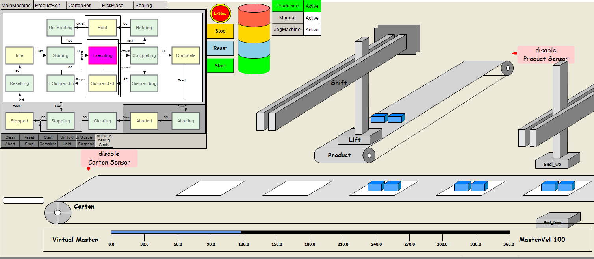

# Pausing Product and Carton Generation

## Overview

By default, a continuous stream of products and cartons is generated according to the behavior of the corresponding sensor signals. The sensor signals are simulated by the [SR\_VisTopLoader program](ProjectStructure-7AD3B398.html#ProjectStructure-7AD3B398__SR_VisTopLoaderProgram-7AD66942). To pause the generation of products or cartons, click the disable Carton Sensor or disable Product Sensor button next to the respective sensor in the visualization. While the sensor is disabled, no sensor signal for new products/cartons is generated and therefore no new products/cartons are added to the belt.

EIO0000005658.01