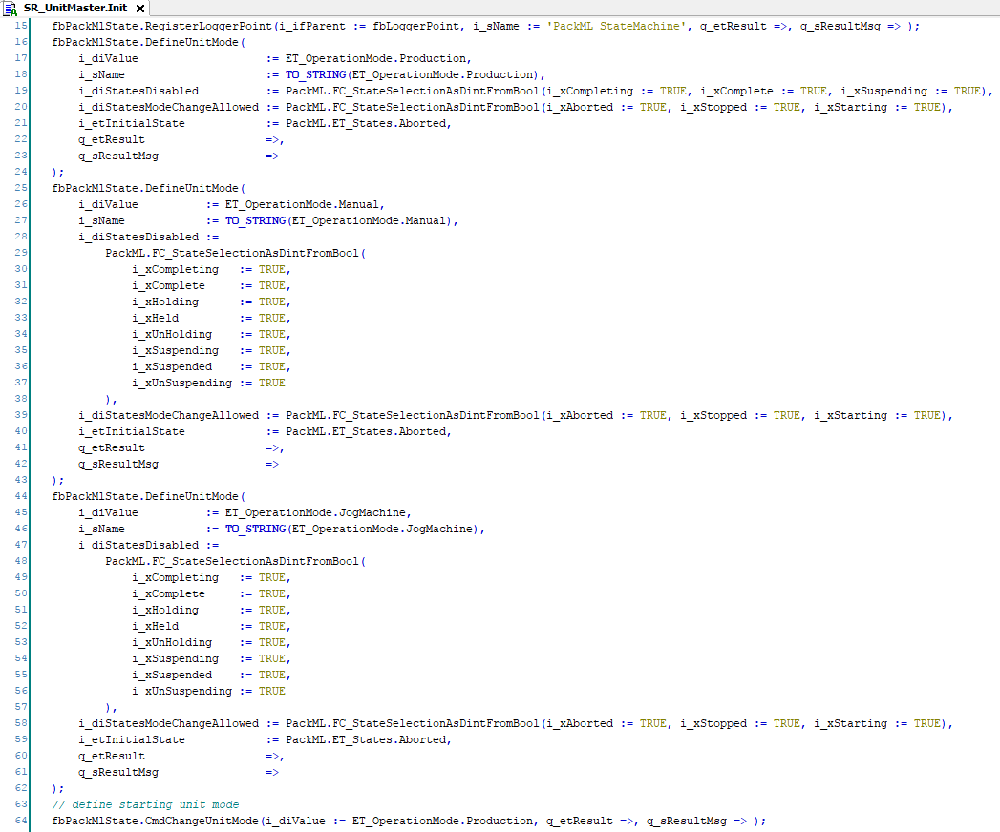
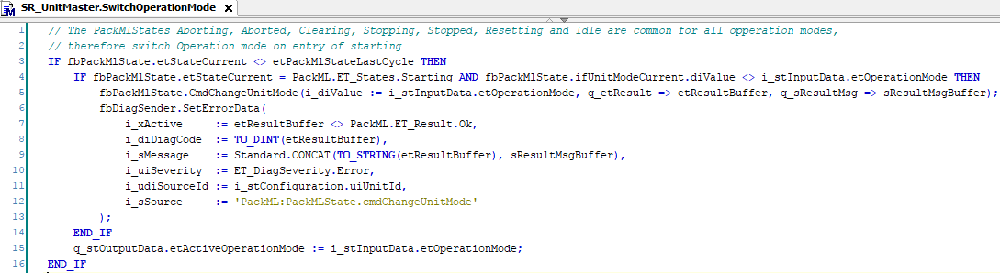

# Defining Unit Control Modes

The unit control modes and the corresponding PackML states that are supported by a [software unit](ProjectStructure-7AD3B398.html#ProjectStructure-7AD3B398__SoftwareUnitsRepresentingMechanicUn-7B34E3C0) need to be defined during the initialization of the unit.

The method [DefineUnitMode of the PackML.FB\_UnitModeManager2](../../../../../api/crossBook?lang=en-US&virtualBookName=PackMLli&topicID=TPC_PackMLli_FB_UniMdMng2_DefineUnitMode) adds an additional unit control mode to the PackML state machine. The number and name of the unit control mode can be retrieved from the enumeration of this application for the unit control modes. The unsupported PackML states need to be provided, rather than the supported PackML states. The bit pattern for any combination of PackML states can be created with the [PackML.FC\_StateSelectionAsDintFromBool() function](../../../../../api/crossBook?lang=en-US&virtualBookName=PackMLli&topicID=FC_StatSelDintFrBool_343876F9). In the same way, the PackML states need to be selected, in which a switch of unit control modes is possible.

The cyclically called method SwitchOperationMode verifies whether a switch of the unit control mode is requested by the inputs of the unit, and whether the unit is ready to execute the switch of unit control mode. If both conditions are met, the unit control mode switch is triggered by calling the [CmdChangeUnitMode method of the PackML.FB\_UnitModeManager2](../../../../../api/crossBook?lang=en-US&virtualBookName=PackMLli&topicID=TPC_PackMLli_FB_UniMdMng2_CmdChangeUnitMode).

EIO0000005658.01