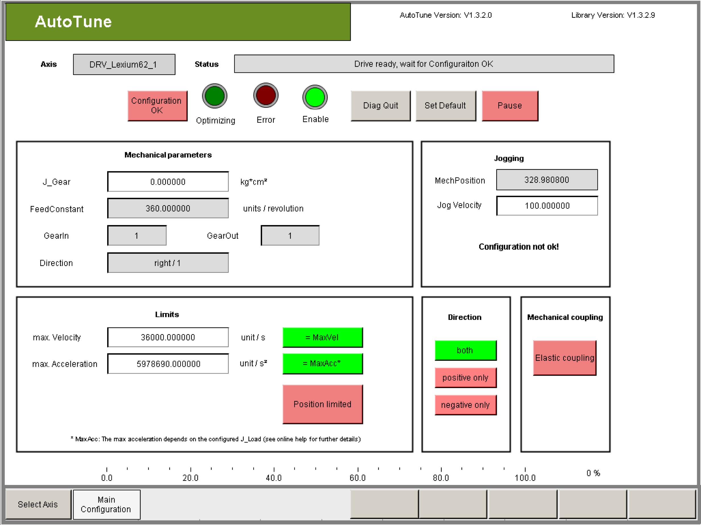

# Drive Configuration (Main Configuration)

Drive Configuration (Main Configuration)

Description

| Step | Action |
| --- | --- |
| 1 | Check if the reset parameters gear factors GearIn and GearOut, feed forward constant FeedConstant and the direction of rotation Direction are parameterized correctly. |
| 2 | Ensure that the J\_Gear parameter contains the desired value. |

| Step | Action |
| --- | --- |
| 1 | Check if the reset parameters feed forward constant FeedConstantLinear and the direction of rotation Direction are parameterized correctly. |

| Step | Action |
| --- | --- |
| 1 | Set the mechanical limits of axis by configuring parameters  omax. Velocity  omax. Acceleration  omin. Position  omax. Position  In order to be able to enter limit values for the position, click the Position limited button.  The limit values serve for monitoring the optimization process. |

|  |
| --- |
| Danger_Color.gifDANGER |
| Limit values not adjusted to the machine! |
| The machine may be damaged or destroyed!  oCheck the limits.  oAdjust the limits. |
| Failure to follow these instructions will result in death or serious injury. |

|  |
| --- |
| Danger_Color.gifDANGER |
| Real position of axis does not match to the position indicated by the parameters of the drive object. |
| The machine may be damaged or destroyed!  oPerform homing before start AutoTune |
| Failure to follow these instructions will result in death or serious injury. |

NOTE: The limits do not affect the travel cycle of the axis when optimizing the controller parameters (sending noise) because they were selected such that good settings can be found using minimal movement on the axis. Therefore the user cannot influence the reference velocity and the reference acceleration of the travel cycles.

Exception: If the start parameters have been selected unfavorable and oscillations are detected on the drive, then increased values for the (actual) velocity and the (actual) acceleration can occur.

You are personally responsible for setting the permitted position range!

In order to perform a successful optimization, an optimization step must be performed within the permitted position range. The required position range can change during the optimization run. A certain required value for acceleration, velocity and position range must not be undershot. The amount of the required value depends on the mechanics of the drive. If the parameterized limits are exceeded, optimization is canceled. Automatic controller optimization cannot be used if this is the case.

NOTE: Input values that exceed the global limit values are automatically limited after they are entered. However, nothing can be derived about the correctness of these parameters from the limits. In this way, limited values may cause problems and errors.

This is why all the parameters have to be checked if they are correct after they were entered!

Tips for Parameterizing the Configuration

| Element | Description |
| --- | --- |
| Button Set Default | If there are no mechanical limitations, you can use the preset values. By clicking on this button all the configuration parameters will be reset to the standard values. |
| Rectangle max. Velocity | The maximum velocity of the axis is specified in units per second with Max. velocity. This value is used to monitor the actual velocity at the motor. If this value is exceeded then the optimization is stopped. |
| Rectangle max. Acceleration | The maximum acceleration of the axis is specified in units per second squared when you select Max. acceleration. This value is used to monitor the (actual) acceleration at the motor. If this value is exceeded then the optimization is stopped.  The maximum value is 250% of the acceleration that theoretically occurs at the motor without load due to acceleration with MaxDrivePeakCurrent.  NOTE: Input values that exceed this maximum value are automatically limited after they are entered. However, nothing can be derived about the correctness of these parameters from the limits. Even this way limited values can cause problems and errors!  This is why all the parameters have to be checked if they are correct after they were entered! |
| Button Position limited | This button is only offered for rotary drives. The input fields min. Position and max. Position are only displayed when this button is activated (green).  By linear drives the input fields min. Position and max. Position are always displayed. The position range is always monitored. |
| Rectangle min. Position / max. Position | If necessary, Min. position and Max. position can be used to configure limit positions, for example, if there is a limit stop. Thereby the min. Position must always be less than the max. Position and MechPosition (actual position). The Max. Position must always be greater than the min. Position and MechPosition (actual position). |
| Button positive only | Click on this button (green = active) if the direction of motion can only take place in positive direction during the optimization due to mechanical restrictions. Positive is the direction in which the velocity is displayed positive and the value of the parameter MechPosition increases. |
| Button positive only | Click on this button (green = active) if the direction of motion can only take place in negative direction during the optimization due to mechanical restrictions. Negative is the direction in which the velocity is displayed negative and the value of the parameter MechPosition decreases. |

|  |
| --- |
| Danger_Color.gifDANGER |
| Mechanic moves in the wrong direction. |
| The machine may be damaged or destroyed!  oVerify the value of the drive parameter ‘Direction’  oVerify the configuration in AutoTune |
| Failure to follow these instructions will result in death or serious injury. |

| Element | Description |
| --- | --- |
| Button Elastic coupling | Activate this button (green = active), if the load is coupled mechanically „soft“ (elastic). This is the case for example by belt drives. |
| Button Configuration OK | Confirm the set configuration with the button Configuration OK if all the relevant parameters were checked and parameterized correctly.  G-SE-0071513.1.gif-high.gif      Result: The parameterized limits are activated in the drive.  Result: The button Start is displayed and the automatic controller optimization can be started.  Result: The Jogging group is activated.  Result: The buttons Advanced Configuration, Results, and Test become available to change to the corresponding visualization window. |
| Group Jogging | With jogging it is possible to bring the drive in a desired starting position. This functionality can only be used if with Configuration OK it has been confirmed that all the parameters and limits were parameterized correctly.  Since the drive switches to control mode during jogging, the controller has to be stable, so that no unwanted movement of the axes occur. |
| Button Advanced Configuration | Click Advanced Configuration to switch to the Advanced Configuration visualization.  Result: The Advanced Configuration visualization opens.  See also chapter [Configuration for Experienced Users (Advanced Configuration)](../Visualization/Visualization-5.htm#XREF_D_SE_0091188_1). |

EIO0000003629.00

© 2018 Schneider Electric. All rights reserved.