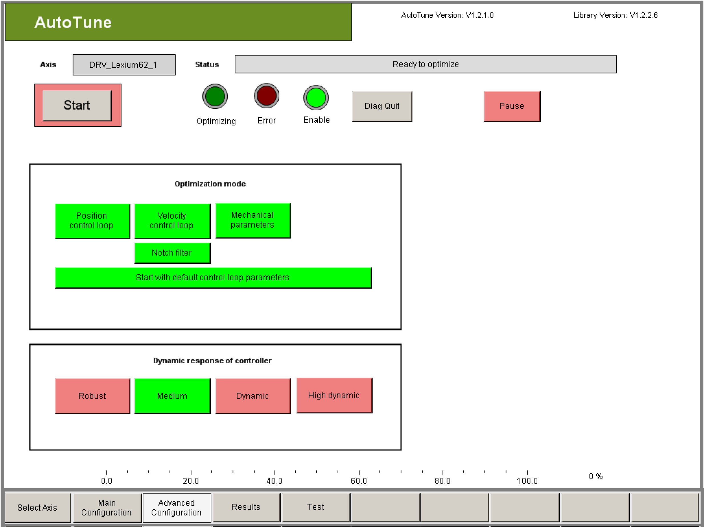

# Configuration for Experienced Users (Advanced Configuration)

Configuration for Experienced Users (Advanced Configuration)

Description

| Step | Action |
| --- | --- |
| 1 | If necessary, parameterize Advanced Configuration.  The Advanced Configuration does not have to be adjusted. In many cases, the default settings can be used.  You should only make adjustments if you do not achieve the required optimization results with the preset values. |
| 2 | Continue commissioning with [Perform Optimization](#XREF_D_SE_0091183_5) if you do not want to perform the Advanced Configuration. |

Optimization Mode

| Element | Description |
| --- | --- |
| Button Position control loop | If all sections are optimized (standard setting), then it optimizes in the following order:  1. Speed control loop including the NotchFilter  2. Position control loop  3. Mechanical parameters  See chapter [Optimization Mode](../Visualization/Visualization-5.htm#XREF_D_SE_0091188_3).  The optimizations also build up on each other in this sequence.  This means that if for example a position control has to be optimized, the speed control loop has to be optimized already or at least have a stable control behavior. |
| Button Notch filter | The optimization of the NotchFilter is a new function of the Version V4.0 (Drives Firmware Version V1.50.x.0; AutoTune Version V1.2.x.0). Activated as standard. If the optimization shall react as before in previous versions, then this function must be switched off. |
| Button Start with default control loop parameters | With this button the start values can be specified for the optimization.  If this button is activated (green), then all the relevant parameters are reset to standard values when the optimization is started. Normally this is how always a stable start behavior is achieved.  If this button is deactivated (red), then all the parameters are taken over unchanged when the optimization is started. Then the user is responsible that the start takes place with parameters that provide a stable control behavior. |
| Button Fixed Load Inertia | This button only appears if the optimization mode "Mechanical Parameters" is not activated. If the optimization mode "Mechanical Parameter" is activated, then "FixedLoadInertia" always is deactivated.  With the button FixedLoadInertia the pre-calculated values from J\_Load and J\_Gear or LoadInertiaLinear can be "frozen". The values will then be considered as constants during optimization and not changed.  oClick on Fixed Load Inertia if the parameters J\_Load and J\_Gear or LoadInertiaLinear shall remain unchanged during the optimization.  Result: An input window for J\_Load or LoadInertiaLinear appears.  oEnter a value for the parameter J\_Load or LoadInertiaLinear if Fixed Load Inertia has been activated. This value is not changed during the optimization. |
| Button Start Load Inertia | This button only appears if the optimization mode "Mechanical Parameters" is activated and the optimization mode "Velocity control loop" is not activated. If the optimization mode "Mechanical Parameter" is not activated or the optimization mode "Velocity control loop" is activated, then "Start Load Inertia" is always deactivated.  With the button Start Load Inertia the start value for the optimization of the mechanical parameters is predefined. The user should be able to estimate the true value of the inertia with a deviation not exceeding -50% downward and +100% upward.  oClick on the button Start Load Inertia if problems occurred by the automatic determination of the start values and you are able to estimate the parameters J\_Load and J\_Gear or LoadInertiaLinear with the required accuracy.  Result: An input window for J\_Load or LoadInertiaLinear appears.  oEnter a value for the parameter J\_Load or LoadInertiaLinear if the button Start Load Inertia has been activated. This value is used as start value during the optimization of the mechanical parameters. The motion profile for the optimization of the mechanical parameters is changed through this start value. |

Dynamic Response of Controller

| Element | Description |
| --- | --- |
| Button Robust | The robust controller setting can be used only for drives with a low tendency for mechanical oscillations to occur. These are drives that have a relatively fixed connection (direct connection or a connection to a high-value drive) between the motor and the load and that have a relatively small mass moment of inertia (Jexternal/Jown <10/1). The mass moment of inertia can be reduced on the motor side by using a gear box (Gearin < Gearout). A robust setting places very high requirements on the stability of the control circuit. If the drive tends to oscillate, these requirements cannot be met. The robust controller setting is only useful for drives in which dynamic response is secondary, but stability and smooth operation are extremely important. |
| Button Dynamic / High dynamic | For drives with a greater tendency to oscillate, it is often useful to not use the default setting of Medium and instead use a dynamic or highly dynamic controller setting for optimization because the demands on drive stability are lower. This allows an optimal controller setting to be found even for these drives. In addition, by selecting a dynamic or highly dynamic controller setting, the tracking deviation is generally reduced compared to medium dynamic response.  Also see chapter [Optimization Mode](../Visualization/Visualization-5.htm#XREF_D_SE_0091188_3). |

NOTE: AutoTune does not change the current controller.

Thus, make sure that the current controller is correctly parameterized before optimization.

To this end, check the parameters Curr\_P\_Gain, Curr\_I\_Gain, PowerStageFrequency and VoltageFeedForwardMode.

These parameters are also displayed in the Results visualization window. However, parameters can only be changed directly via the object parameters of the drive or for the PowerStageFre­quency via the FC\_PowerStageFrequencySet() function of the SystemInterface library.

Perform Optimization

| Element | Description |
| --- | --- |
| Button Start / Stop | Click the "Start" button to begin the optimization.  Result: The frame around the button becomes green and the text in the button changes to "Stop".  NOTE: With the same button AutoTune can be stopped at all times.  If the optimization is stopped this way or if a problem occurs during the optimization then the following window appears:  G-SE-0071515.1.gif-high.gif      The user has to press one of the two buttons before further entries are possible:  The controller parameters and the mechanical parameters are reset to the values that were set by the start of the optimization with the button Original values.  The controller parameters and mechanical parameters that were already found through the canceled optimization are taken over into the PLC configuration with the button Keep results.  NOTE: When pressing the button Keep results the user has no statement on the quality of the controller- and mechanical parameters. These parameters can cause an unstable controller behavior!  This is why the user has to check if the set parameters result in a good controller behavior. He is responsible for the quality of the parameters himself! |
| Button Results | Click the on the button Results to switch to the Results visualization.  Results: The visualization "Results" opens.  See also chapter [Results](../Visualization/Visualization-6.htm#XREF_D_SE_0091189_1).  The progress of the optimization can be traced here the best.  NOTE: AutoTune only estimates the J\_Load moment of inertia.  This is why it is possible that the parameter might have a wrong value even if the optimization was successful. The consequence is, that the current feed forward is not adjusted to the mechanic. This causes an increased tracking deviation on the axis.  This is why you should check manually if the J\_Load parameter is correct with the FeedbackCurrent in case of doubt.  Changing the J\_Load parameter after a successful optimization changes the behavior of the speed controller. The controller then is no longer optimized.  Wait until optimization is complete. This process can take between 2 and 5 minutes.  Check whether optimization has been completed successfully. This is indicated by the displayed status.  oClick the on the Test button if you want to test the controller setting.  Result: The visualization window "Test" opens. This allows you to configure and start the positioning.  oIf an optimization run has not been completed successfully, or if the optimization result does not meet your expectations, restart the optimization after you adjust the appropriate parameters.  If the optimization of the parameters has been completed for all the axes, you can switch back to normal operation (AUT.G\_xAutoTuneEnable = FALSE). |

EIO0000003629.00

© 2018 Schneider Electric. All rights reserved.