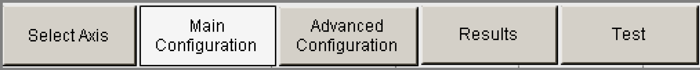

# Overview

Overview

Description

The following visualization windows are available to display the AutoTune automatic controller optimization:

oSelect Axis: Drive selection

oMain Configuration: Drive configuration

oAdvanced Configuration: Configuration for experienced users

oResults: Display of the results

oTest: Positioning test

Use the visualization window "Select axis" as the start window when optimizing the controller. With the following buttons it is possible to change to other visualization windows.

The visualization windows and their elements are explained in the following subsections.

General Elements

The shape of the elements in the visualization indicates their meaning.

The following types of elements are defined:

| Element | Description |
| --- | --- |
| G-SE-0071517.1.gif-high.gif | Round with a gray edge: display of status parameters  oDark green: off, not active  oLight green: on, active  or  oDark red: off, no errors  oLight red: on, error active |
| G-SE-0071518.1.gif-high.gif | Rectangle with a light gray background: Display of parameters |
| G-SE-0071519.1.gif-high.gif | Rectangle with a white background: Input field for parameters |
| Button | Rectangle with a dark gray, red, or green background: Button  oRed: button is off (not active)  oGreen: button is on (active)  oDark gray: button without display of the status |
| Group | Black rectangle with a white background: Forms groups of display- and input fields |

Some elements are available in several visualization windows:

At the top right, the versions of AutoTune (defined by the firmware version in the drive) and the version of the library are displayed. Both versions are structured as follows: Va.b.c.d

Numbers a and b of both versions must be the same to start AutoTune.

| Element | Description |
| --- | --- |
| Rectangle Axis | Displays the name of the axis that shall be optimized. This axis name can be selected in the Axis Select visualization window. |
| Rectangle Status | Displays the status of the optimization for the selected axis. |
| Button Start | Starts or stops the automatic controller optimization.  oRed: stopped  oGreen: started  The button text indicates which action is performed the next time the button is selected.  NOTE: The Start button is not available until you click Configuration OK to confirm the correctness of the set parameters in the Main Configuration visualization window. The button becomes invisible if,  oa new axis is selected,  othe release AUT.G\_xAutoTuneEnable is switched off or  othe Main Configuration is changed. |
| G-SE-0071520.1.gif-high.gif | Indicates if the automatic controller optimization is active.  oDark green: not active  oLight green: active |
| G-SE-0071521.1.gif-high.gif | Indicates whether an error was detected.  oDark red: off, no error detected  oLight red: on, error detected |
| G-SE-0071522.1.gif-high.gif | Indicates whether the automatic controller optimization is enabled. This indicates the status of the AUT.G\_xAutoTuneEnable input.  oDark green: not active  oLight green: active |
| Button Diag Quit | With this button a diagnostic message can be reset (acknowledged) if its cause is no longer present.  If a diagnostic message cannot be removed with this button, then the cause has to be eliminated first. |
| Button Pause | With this button an optimization or positioning of AutoTune can be stopped.  oRed: optimization or positioning can run through normally  oGreen: Optimization is stopped at the end of the optimization step or the positioning is stopped at the end of the positioning job  In contrast to the Start button, optimization can be continued by clicking the Pause button again. Optimization will not start from the beginning again. |
| Button Main Configuration | Switch to the corresponding visualization window:  oButton Select Axis: Switches to the drive selection (Select Axis)  oButton Main Configuration: Switches to drive configuration (Main Configuration)  oButton Advanced Configuration: Switches to configuration for experienced users (Advanced Configuration)  oButton Results: Switches to the results visualization (Results)  oButton Test: Switches to the configuration of the positioning test  The buttons Advanced Configuration, Results, and Test are hidden until you confirm the axis limits. To do so, go to the Main Configuration visualization window and click the Configuration OK button. |
| G-SE-0071523.1.gif-high.gif | The progress bar (bar at the very bottom) shows the optimization progress in percent. |

EIO0000003629.00

© 2018 Schneider Electric. All rights reserved.