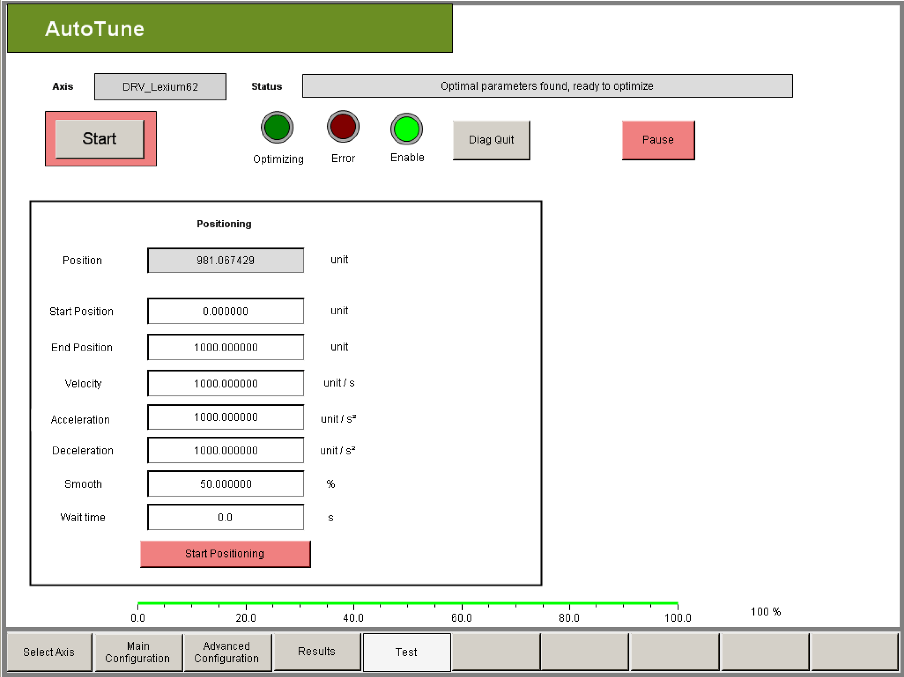

# Positioning Test (Test)

Positioning Test (Test)

Description

The positioning test allows you to check whether the optimization was successful. For this purpose, the axis is moved using a POS profile with the specified parameters.

| Element | Description |
| --- | --- |
| Button Start Positioning | By clicking this button you can start or stop the positioning test.  oRed: Positioning test inactive  oGreen: Positioning test active |
| Rectangle Position | The current actual axis position from the PLC configuration is displayed in units. |
| Rectangle Start position/End position | When starting positioning, the drive first travels to the start position and then travels back and forth between the end and start position. If a position range is defined in the Main Configuration visualization window, the start and end position must be within the position range. |
| Rectangle Velocity | The maximum (reference) velocity for positioning can be entered in units per second. The maximum value is specified by Max. Velocity. |
| Rectangle Acceleration | The maximum (reference) acceleration for positioning can be entered in units per second squared. The maximum value is specified via Max. Acceleration. |
| Rectangle Waiting time | A waiting time in seconds can be entered between the motion sections for the positioning test. The minimum resolution of the waiting time is determined by the cycle time of the task with which AutoTune is processed.  NOTE: The wait time is always an integer multiple of the task cycle time. Therefore the waiting time can vary by one task cycle time. |

EIO0000003629.00

© 2018 Schneider Electric. All rights reserved.