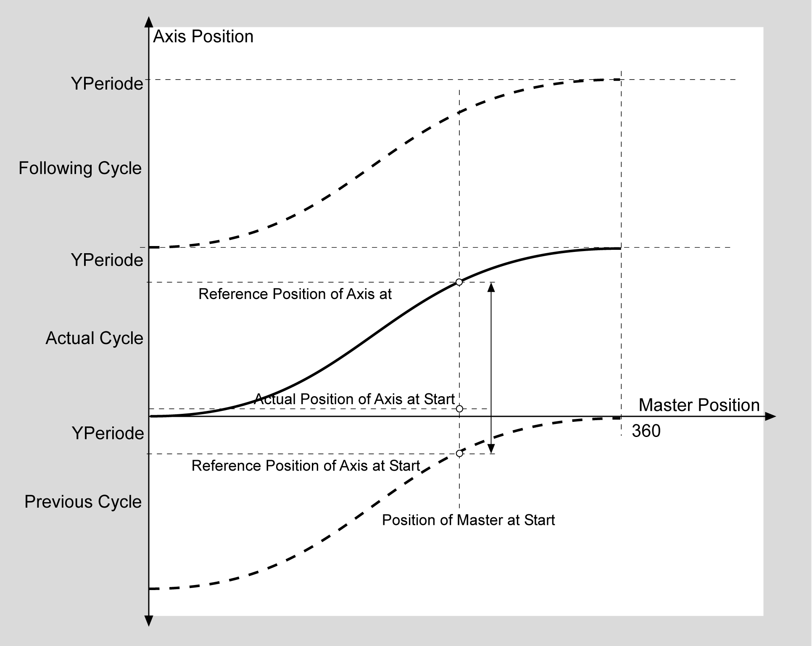
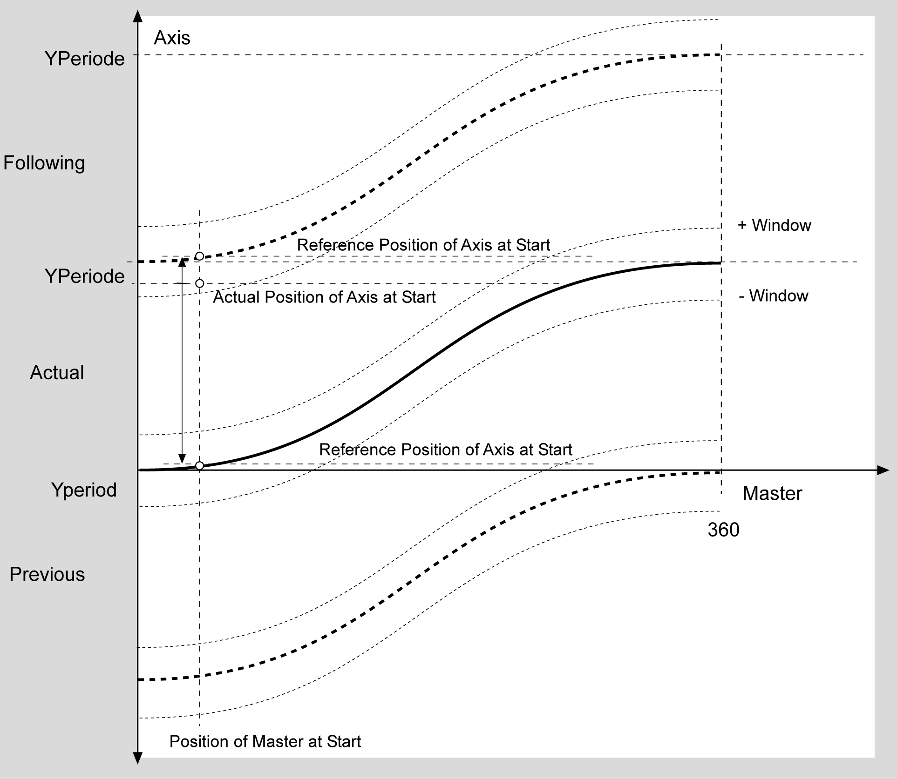

# ET_MultiCamWsMode

ET\_MultiCamWsMode

ET\_MultiCamWsMode - General Information

Overview

|  |  |
| --- | --- |
| Type: | Enumeration type |
| Available as of: | V1.0.0.0 |

Description

Enumeration type for the warm start mode of the cam slave.

Warm start means to start in the middle of a motion sequence (e.g., after an emergency stop).

During warm start, the reference position of the slave axis is determined based on the master position taken from the cam. The axis is then moved to this reference position with a positioning instruction. Only after this is the curve re-activated.

As soon as the drive position is back at the cam position, the output q\_xSynActive is set. This signal can be used to start the master encoder.

The master encoder must be at a standstill during warm start.

For cams with a period (start point <>end point), the cycle is examined before and after the cam for a warm start. Under certain conditions, it is shorter to travel in one of the neighboring curves.

The master encoder position and axis position is always brought into the corresponding period during warm start, i.e. master encoder position = modulo (master encoder position, X period).

The periods are calculated as follows:

YPeriod = Y\_finalpoint – Y\_firstpoint (axis)

X period = X\_finalpoint – X\_firstpoint (master encoder)

The YPeriod can also be specified directly in the MultiCam structure ([ST\_MultiCam](../Structures/Structures-3.htm#XREF_D_SE_0096123_1)). As soon as MultiCamStruct.YPeriod <> 0, the value from the structure is used.

Enumeration Elements

| Name | Value | Description |
| --- | --- | --- |
| StoredCamMoveAlwaysNoPositionCheck | 0 | Always move to the position of the saved cam without checking the deviation of the axis position from the cam position.  If the YPeriod <> 0, travel the shortest way; that is, it is eventually moved into the cycle, either before or afterwards. |
| StoredCamMoveToCamPositonInWsWindow | 1 | Move to the position of the saved cam if the deviation of the axis position from the cam position is within the window WsWindow.  If the YPeriod is <> 0, then the window extends beyond the period limit and the subsequent or the previous period is examined. If the window is greater than YPeriod/2, then the response is as in mode StoredCamMoveAlwaysNoPositionCheck. |
| StoredCamMoveForwardToCamPositon | 2 | Always only move forwards to the position of the saved cam. If the deviation of the axis position from the cam position is within the window WsWindow, backward travel is permitted.  If the YPeriod is <> 0, then the axis travels into the next period. Then the window extends beyond the period limit. |
| StoredCamMoveBackwardToCamPosition | 3 | Always only move backwards to the position of the saved cam. If the deviation of the axis position from the cam position is within the window WsWindow, forward travel is permitted.  If the YPeriod is <> 0, then the axis travels into the next period. Then the window extends beyond the period limit. |
| StoredCamShowCamPosition | 4 | In this mode, the axis is not moved; the axis position relative to the saved cam is simply displayed at the output Position Y. |
| StoredCamSetMasterPositionToRelatedSlavePosition | 5 | Calculates the master position for the slave position relative to the saved cam and sets the logical encoder of the MultiCam to the calculated position. The position of the slaves will not be changed. No positioning will be carried out. |
| NewCamMoveAlwaysNoPositionCheck | 10 | Always move to the position of the newly created cam without checking the deviation of the axis position from the cam position.  If the YPeriod <> 0, travel the shortest way; that is, it is eventually moved into the cycle, either before or afterwards. |
| NewCamMoveToCamPositonInWsWindow | 11 | Move to the position of the newly created cam if the deviation of the axis position from the cam position is within the window WsWindow.  If the YPeriod is <> 0, then the window extends beyond the period limit and the subsequent or the previous period is examined. If the window is greater than YPeriod/2, then the response is as in mode StoredCamMoveAlwaysNoPositionCheck. |
| NewCamMoveForwardToCamPositon | 12 | Always only move forwards to the position of the newly created cam. If the deviation of the axis position from the cam position is within the window WsWindow, backward travel is permitted.  If the YPeriod is <> 0, then the axis travels into the next period. Then the window extends beyond the period limit. |
| NewCamMoveBackwardToCamPosition | 13 | Always only move backwards to the position of the newly created cam. If the deviation of the axis position from the cam position is within the window WsWindow, forward travel is permitted.  If the YPeriod is <> 0, then the axis travels into the next period. Then the window extends beyond the period limit. |
| NewCamShowCamPosition | 14 | In this mode, the axis is not moved; the axis position relative to the newly created cam is simply displayed at the output Position Y. |
| NewCamSetMasterPositionToRelatedSlavePosition | 15 | Calculates the master position for the slave position relative to the newly created cam and sets the logical encoder of the MultiCam to the calculated position. The position of the slaves will not be changed. No positioning will be carried out. |

Examples

WsMode StoredCamMoveAlwaysNoPositionCheck, NewCamMoveAlwaysNoPositionCheck

WSMode 0, 10: No checking, always move to reference position

In the above example, the curve has a YPeriod, and the distance from the axis position to the reference position of the previous curve is shorter than the distance to the reference position of the current curve. The axis is then moved backwards to the curve position. Thereafter, the position does not have a negative value, but the position value of the curve.

WsMode StoredCamMoveToCamPositonInWsWindow, NewCamMoveToCamPositonInWsWindow

WSMode 1, 11: Move to cam position (slave position) if the axis is within the WSWindow

In the above example, the cam has a YPeriod and the distance from the axis position to the reference position of the current cam is not within the window i\_lrWsWindow. However, the reference position of the following curve is inside the window and so will be started.

WsMode StoredCamMoveForwardToCamPositon, NewCamMoveForwardToCamPositon

WSMode 2, 12: Move forwards only to the cam position

In the above example, the curve has a YPeriod and the axis position is outside of the window. In this case, the axis moves into the next period.

EIO0000003961.00

© 2019 Schneider Electric. All rights reserved.