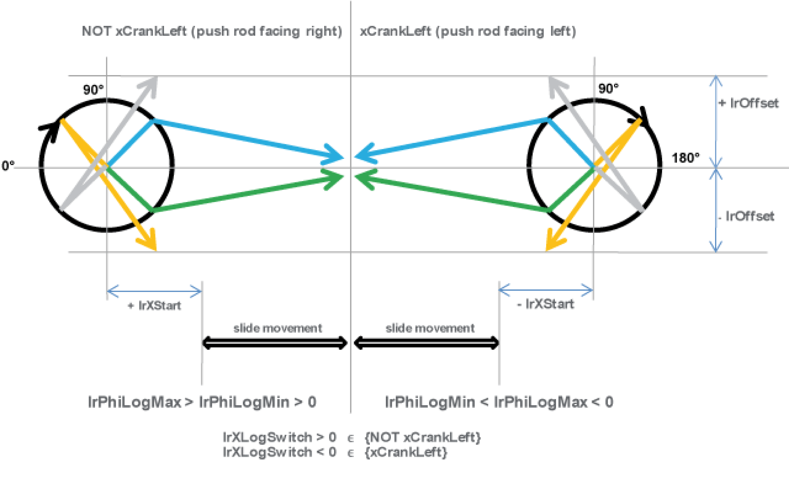
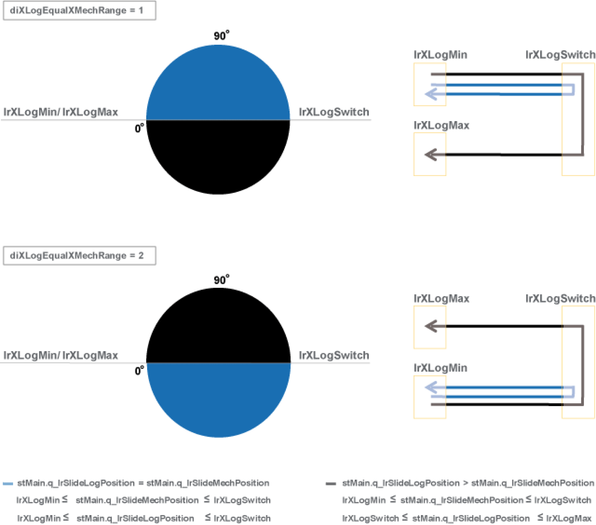
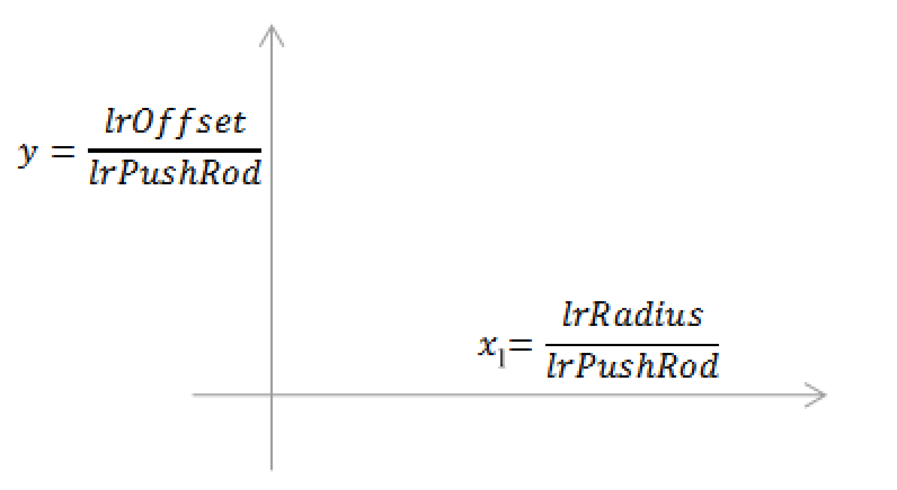

# Crank Parameters

Crank Parameters

Mechanics

Definition of the dimensions

The values of the crank radius (lrRadius) and the push rod length (lrPushRod) are always absolute. Whereas the values of lrXStart (zero position for the slide movement scale) and lrOffset (vertical distance of the slide center to the centre of crank) are not absolute.

Determination of the push rod orientation

Determination of the dimensions

stCrankModuleItf.stCrank.lrRadius := 50.0; (\* Crank radius \*)  
stCrankModuleItf.stCrank.lrPushRod := 157.2; (\* Length \*)  
stCrankModuleItf.stCrank.lrOffset := 0.0; (\* Distance crank center to slide level \*)  
stCrankModuleItf.stCrank.lrXStart := 7.2; (\* Distance crank center to 0-position of slide \*)  
stCrankModuleItf.stCrank.diXLogEqualXMechRange := 1; (\* Range where logical position equals mechanical position of slide \*)

| Push rod facing right | Push rod facing left |
| --- | --- |
| Determination of the push rod orientation (right)  stCrankModuleItf.stCrank.xCrankLeft := FALSE;  (\* TRUE = Crank on the left hand side \*)  (\* FALSE = Crank on the right hand side \*) | Determination of the push rod orientation (left)  stCrankModuleItf.stCrank.xCrankLeft := TRUE;  (\* TRUE = Crank on the left hand side \*)  (\* FALSE = Crank on the right hand side \*) |

diXLogEqualXMechRange

diXLogEqualXMechRange is the range where the logical slide distance equals the mechanical slide distance. Make sure that only values of 1 or 2 have to be used to select the range.

xRange

The variable xRange is only considered if the following criteria is fulfilled:

To verify this criteria proceed as follows:

First, calculate the x1 and y values as shown in the following graph and map them:

Secondly, take the y value and calculate the x2 value by using the formula below:

If x1 = x2, then:

ofor a LEFT motion range

stMain. stCrank.xRange := TRUE

ofor a RIGHT motion range

stMain. stCrank.xRange := FALSE

Example:

Setting intervals for an extreme slide axis position

The extreme positions of the linear axis ([xMechMin](../../../../../../api/crossBook?lang=en-US&virtualBookName=PD.Lib.PacDriveLib&topicID=D_SE_0087724_1) and [xMechMax](../../../../../../api/crossBook?lang=en-US&virtualBookName=PD.Lib.PacDriveLib&topicID=D_SE_0087724_1)) represent a critical point in the transformation, since the velocity of the linear axis must be zero at that point, independent of the velocity of the crank axis. Therefore, it is not possible to set any linear axis motions beyond this point.

To eliminate this problem, the crank transformation is replaced by a polynomial of the fifth degree, whose slope never becomes zero in this range, in a configurable range in the extreme positions of the linear axis. In this range the linear axis no longer follows the set motion. But the velocity of the crank axis remains limited.

stCrankModuleItf.stCrank.lrP5Pole1IntervalLow := 0.5; (\* Distance X pole 1 <-> low end of interpolation interval \*)

stCrankModuleItf.stCrank.lrP5Pole1IntervalHigh := 0.5; (\* Distance X pole 1 <-> high end of interpolation interval \*)

stCrankModuleItf.stCrank.lrP5Pole2IntervalLow := 0.5; (\* Distance X pole 2 <-> low end of interpolation interval \*)

stCrankModuleItf.stCrank.lrP5Pole2IntervalHigh := 0.5; (\* Distance X pole 2 <-> high end of interpolation interval \*)

The above intervals may be selected so large that they overlap. In this case there is a further option available to adapt the crank movement to the requirements of the application in order, e.g. to keep the maximum occurring velocity below a specific value.

NOTE: This option should only be used by experts. If you need assistance or have questions concerning the use of this crank movement adaption, please contact your support team.

stCrankModuleItf.stCrank.lrP5RangeLow := 2.0; (\* only for overlapping interpolation intervals: definition range of start polynomial \*)

stCrankModuleItf.stCrank.lrP5RangeHigh := 2.0; (\* only for overlapping interpolation intervals: definition range of end polynomial \*)

EIO0000002638.00

© 2018 Schneider Electric. All rights reserved.