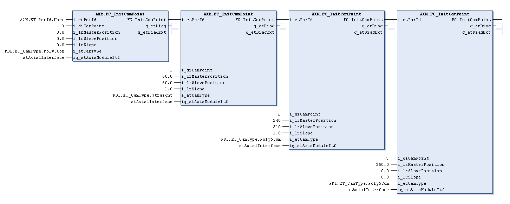

# FC_InitCamPoint

FC\_InitCamPoint

FC\_InitCamPoint - General Information

Overview

|  |  |
| --- | --- |
| Type: | Function |
| Available as of: | V1.1.0.0 |
| Support for: | PacDrive3 pilot template architecture |
| Versions: | Current version |

Task

Function for initialization of an axis that is controlled by the [FB\_AxisModule](../Function_Blocks/Function_Blocks-3.htm#XREF_D_SE_0077136_1) function block.

Description

This function is used to assign values to a cam point. It also assigns the cam point to a MultiCam table. The table is specified with i\_etParId and the axis is specified with iq\_stAxisModuleItf.

This function returns the MultiCam table number (i\_etParId) to allow multiple interfaces to be specified as shown below. The function returns -1 if the specified MultiCam table number (i\_etParId) is not 0, 1, 2, 3, or 4.

Each interface requires a unique number specified by i\_diCamPoint. The first cam point is set to 0, the second 1, and so forth up to 32. The total quantity of cam points for a MultiCam table is automatically set.

The i\_etParId input specifies the cam to follow to the next motion point and the [PDL.ET\_CamType](../../../../../../api/crossBook?lang=en-US&virtualBookName=PD.Lib.PacDriveLib&topicID=D_SE_0087211_1) enumeration type contains all the possible cam types.

Interface

| Input | Data type | Description |
| --- | --- | --- |
| i\_etParId | ET\_ParId | Specifies which MultiCam table this cam point belongs to |
| i\_diCamPoint | DINT | Specifies which cam point this is (0 to 32) |
| i\_lrMasterPosition | LREAL | Specifies the master’s position at this cam point in units |
| i\_lrSlavePosition | LREAL | Specifies the axis’s position at this cam point in units |
| i\_lrSlope | LREAL | Specifies the slope of the curve at this cam point (Horizontal line = 0, 45 degree line = 1) |
| i\_etCamType | PDL.ET\_CamType | Specifies the type of curve used to connect to the next cam point |

| Input/Output | Data type | Description |
| --- | --- | --- |
| iq\_stAxisModuleItf | ST\_ModuleInterface | The axis interface structure of the associated axis |

EIO0000002644.00

© 2018 Schneider Electric. All rights reserved.