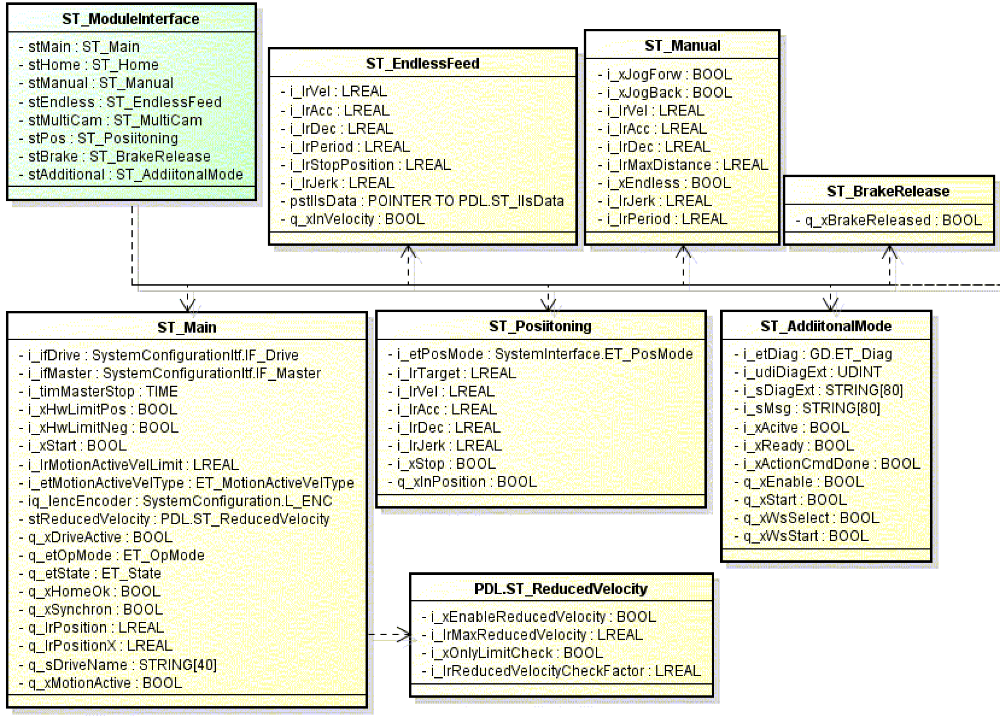
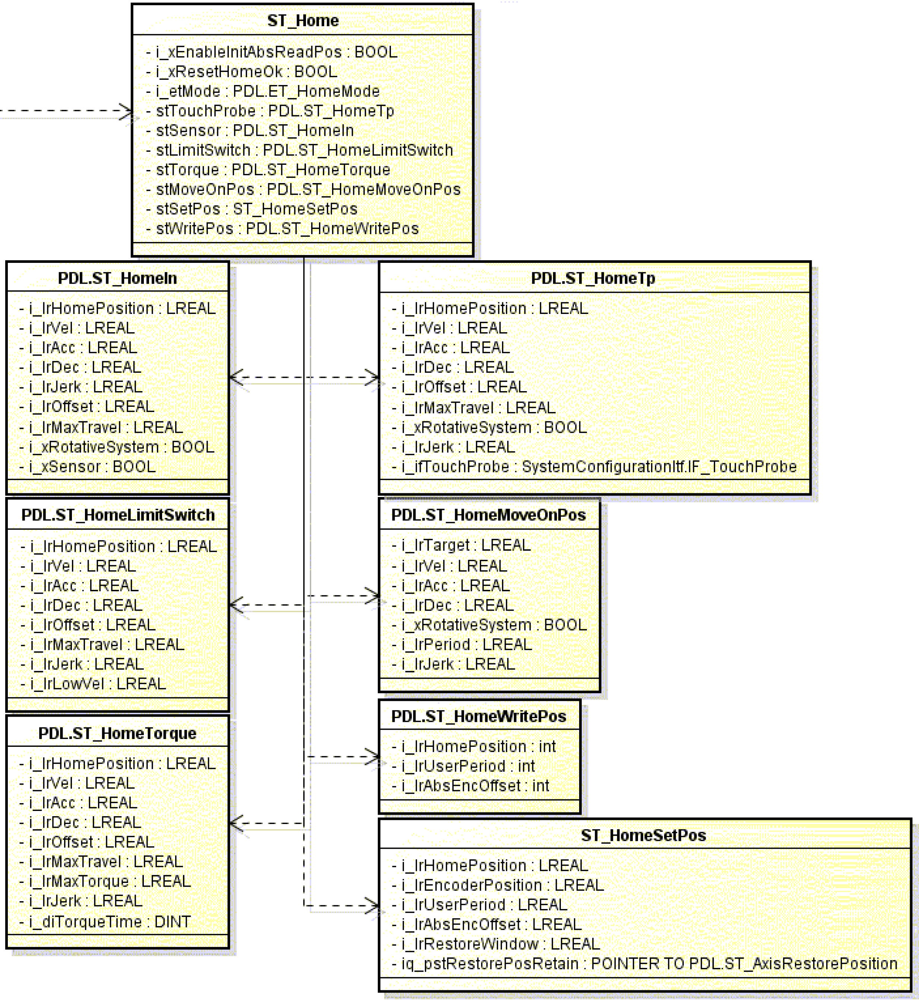

# ST_ModuleInterface

ST\_ModuleInterface

ST\_ModuleInterface - General Information

Overview

|  |  |
| --- | --- |
| Type: | Data structure |
| Available as of: | V1.0.2.0 |
| Inherits from: | - |
| Versions: | Current version |

Description

The structure contains all module-specific parameters and return values for the [FB\_AxisModule](../Function_Blocks/Function_Blocks-3.htm#XREF_D_SE_0077136_1).

Structure Elements

| Variable | Data type | Description |
| --- | --- | --- |
| stMain | [ST\_Main](Structures-7.htm#XREF_D_SE_0077223_1) | Cross-operating mode parameters and return values. |
| stHome | [ST\_Home](Structures-5.htm#XREF_D_SE_0077219_1) | Parameters and return values of the operating mode Homing. |
| stManual | [ST\_Manual](Structures-8.htm#XREF_D_SE_0077225_1) | Parameters and return values of the operating mode Manual. |
| stEndless | [ST\_EndlessFeed](Structures-4.htm#XREF_D_SE_0077217_1) | Parameters and return values of the operating modes Endless and Endlesslls. |
| stMultiCam | [ST\_MultiCam](Structures-10.htm#XREF_D_SE_0077229_1) | Parameters and return values of the operating mode MultiCam. |
| stPos | [ST\_Positioning](Structures-11.htm#XREF_D_SE_0077231_1) | Parameters and return values of the operating mode Positioning. |
| stBrake | [ST\_BrakeRelease](Structures-3.htm#XREF_D_SE_0077215_1) | Parameters and return values of the operating mode Brake. |
| stAdditional | [ST\_AdditionalMode](Structures-2.htm#XREF_D_SE_0077213_1) | Parameters and return values of the operating mode Additional. |

Detailed Interface Overview

EIO0000002644.00

© 2018 Schneider Electric. All rights reserved.